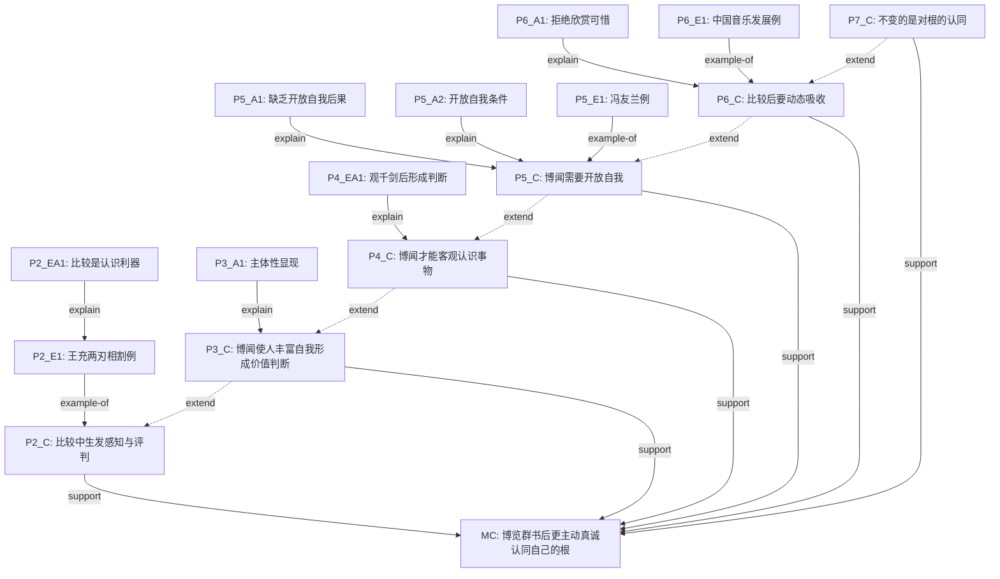

======================================================================
ArgGraph-Agent 多步推理对话日志
======================================================================

**样本**：e05_万种风烟过眼后（一类上 70分）
**作文题目**：2019年上海秋考·中国味

---
## Step 1: ADU 切分

**Agent Thought**：首先需要将文本按 SOP §1-2 规则切分为论证单元。

**Agent Action**：调用 ADU Segmenter

**Observation**：切分完成，共 18 个 ADU，7 个自然段。

**ADU 列表（前 10 个）**：
| ADU ID | 文本（截取） |
|--------|-------------|
| P1_S1 | 记得歌里唱道：“若非万种飞烟都过眼， 怎会迷恋巫山的那一片。”... |
| P1_S2 | 言甚是，若不曾含英咀华，怎能找到心中真正认同的美？... |
| P1_S3 | 而博览群书，知晓众人长，也必定会对自己的“根”，对心中的价值，拥有比别人更主动、更真诚的认同。... |
| P2_S1 | 我们都是在比较之中，生发出对事物的感知与评判。... |
| P2_S2 | 王充的“两刃相割，利钝乃知，两论相驳，是非乃定”便是一例，通过比较，事物各自特点凸显，优劣立分，是非... |
| P2_S3 | “比较”实在是我们认识事物的一把利器。... |
| P3_S1 | 虽然“博闻”也不一定是比较，然而我向之所言，已带了主观的评判色彩，博闻本身使人丰富自我而并非无倾向，... |
| P3_S2 | “万种风烟之后”我之主体性方才显现，若是腹中空空，那么所谓认识与观点，自然基于空想，流于浅薄。... |
| P4_S1 | 由是观之，我们要真正做到“博闻”才能真正客观地认识事物，所谓“操千曲而后晓声，观千剑而后识器”便是此... |
| P4_S2 | 在观“千剑”之后，形成对良器的判断，这便是博闻的作用了。... |
| ... | ... 共 18 个 ADU |

---
## Step 2: 组件分类

**Agent Thought**：ADU 切分完成。接下来需要按 SOP §3-6 识别 MC、段落 Claim，并将剩余 ADU 分类。

**Agent Action**：调用 Component Classifier

**Observation**：分类完成，共 16 个节点。

**节点分类统计**：
| 类型 | 数量 |
|------|------|
| A（分析） | 4 |
| E（论据） | 3 |
| EA（论据分析） | 2 |
| MC（中心论点） | 1 |
| 段落Claim | 6 |

**识别出的 MC**：`MC` — "而博览群书，知晓众人长，也必定会对自己的“根”，对心中的价值，拥有比别人更主动、更真诚的认同。..."
  - 判定理由：位于第一段段尾（最后一句）, 含有总结性判断'必定会'，表达价值表态, 统摄全文：P2讲比较认识事物，P3讲博闻形成主体性，P4讲博闻客观认识，P5讲开放自我，P6讲动态吸收，P7总结认同根魂，均围绕'博闻后更主动真诚认同自己的根'这一核心

**段落 Claim**：
  - `P2_C`: 我们都是在比较之中，生发出对事物的感知与评判。
  - `P3_C`: 虽然“博闻”也不一定是比较，然而我向之所言，已带了主观的评判色彩，博闻本身使人丰富自我而并非无倾向，只是看到千万书卷，万
  - `P4_C`: 由是观之，我们要真正做到“博闻”才能真正客观地认识事物，所谓“操千曲而后晓声，观千剑而后识器”便是此意。
  - `P5_C`: 而所谓的博闻，与博闻中的比较，都需要一个开放的自我。
  - `P6_C`: 比较之后得到自己认同的价值，我们也不能抱守不放，而更要动态吸收，博采众长，才能算真正认识了事物。
  - `P7_C`: 正所谓，万种风烟过眼后，心中最美景，还是随时变，只是那份不变的，是根，是魂，是自我对它发自内心的认同。

---
## Step 3: 关系构建 + 一致性检查

**Agent Thought**：组件分类完成，现在需要按 SOP §7-13 构建论证关系图。

**Agent Action**：调用 Relation Builder

**Observation**：关系构建完成，共 20 条边。

**关系统计**：
| 关系类型 | 数量 |
|---------|------|
| example-of | 3 |
| explain | 6 |
| extend | 5 |
| support | 6 |

**边表（前 10 条）**：
| From | To | Relation | Reasoning |
|------|----|----------|-----------|
| P2_C | MC | support | 第二段主张'比较生发感知与评判'，为MC中'博闻后更主动认同'提供认识论基础，默 |
| P3_C | MC | support | 第三段主张'博闻使人丰富自我并形成价值判断'，直接支持MC中'博览群书后更主动真 |
| P4_C | MC | support | 第四段主张'博闻才能客观认识事物'，为MC中'知晓众人长后认同'提供前提，默认s |
| P5_C | MC | support | 第五段主张'博闻需要开放自我'，补充MC中'博闻'的条件，默认support |
| P6_C | MC | support | 第六段主张'比较后要动态吸收'，深化MC中'认同'的动态性，默认support |
| P7_C | MC | support | 第七段总结'不变的是对根的认同'，直接呼应并强化MC，默认support |
| P2_E1 | P2_C | example-of | 王充事例作为'比较生发感知'的具体例证，标志词'便是一例' |
| P2_EA1 | P2_E1 | explain | 对王充事例进行总结分析，解释其如何证明比较的作用 |
| P3_A1 | P3_C | explain | 解释'博闻后自我有价值判断'的原因，即'主体性显现' |
| P4_EA1 | P4_C | explain | 对'操千曲观千剑'的引用进行分析，解释博闻如何帮助客观认识 |
| ... | ... | ... | 共 20 条边 |

---
## Step 4: 一致性检查（§14）

**Agent Thought**：论证图构建完成，需要按 SOP §14 执行一致性检查。

**检查结果**：
| 检查项 | 结果 |
|--------|------|
| 段落 Claim → MC 连接 | ✅ 通过 |
| Evidence → Claim 连接 | ✅ 通过 |
| 孤立节点 | ✅ 无 |
| 循环检测 | ✅ 无环 |

---
## 最终输出

**论证结构总结**：本文采用总-分-总递进式论证结构。首先提出中心论点：博览群书后会对自己的根和价值拥有更主动真诚的认同。然后从五个层面递进展开：第二段论证比较是认识事物的基础，第三段延伸至博闻形成主体性，第四段总结博闻使人客观认识，第五段补充开放自我的条件，第六段深化为动态吸收。最后第七段总结，强调不变的是对根的认同。全文层层递进，逻辑严密。

**论证树**：
```
MC
├── P2_C [support]
│   └── P2_E1 [example-of]
│       └── P2_EA1 [explain]
├── P3_C [support]
│   ├── P3_A1 [explain]
│   └── (extends from P2_C)
├── P4_C [support]
│   ├── P4_EA1 [explain]
│   └── (extends from P3_C)
├── P5_C [support]
│   ├── P5_A1 [explain]
│   ├── P5_A2 [explain]
│   ├── P5_E1 [example-of]
│   └── (extends from P4_C)
├── P6_C [support]
│   ├── P6_A1 [explain]
│   ├── P6_E1 [example-of]
│   └── (extends from P5_C)
└── P7_C [support]
    └── (extends from P6_C)
```

**Mermaid 代码**：
