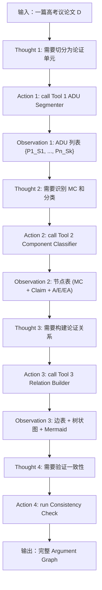
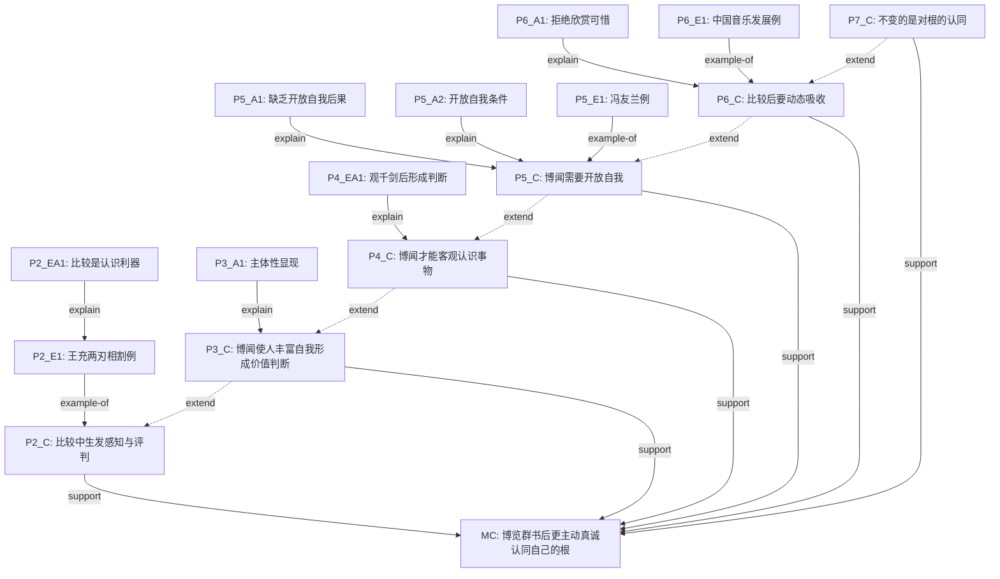

# 《人工智能基础》大作业 实验报告

| 项目 | 内容 |
|------|------|
| **选题编号** | 选题一：AI Agent 框架搭建 |
| **项目名称** | ArgGraph-Agent — 面向高考议论文的论证结构自动拆解智能体 |
| **组长** | 曾栎凝（学号 3250102562） |
| **组员** | 汤明德（学号 3250104743） |
| **提交日期** | 2026年06月14日 |

---

## 目录

1. [核心原理与算法设计](#一核心原理与算法设计)
2. [工程实现细节](#二工程实现细节)
3. [实验结果与分析](#三实验结果与分析)
4. [参考文献](#四参考文献)

---

## 一、核心原理与算法设计

### 1.1 项目概述

ArgGraph-Agent 是一个基于 ReAct（Reasoning + Acting）范式的 AI Agent，面向高中议论文的论证结构自动拆解。系统将 14 节 SOP（标准操作流程）规则编码为三个专业工具，通过 DeepSeek-v3 API 实现端到端的 Argument Graph 自动生成。

核心创新点：将严谨的人工标注规范（SOP）编码为 AI Agent 的工具链，使 LLM 在结构化流程的约束下执行论证拆解，既保留了规则的严格性和可解释性，又利用了 LLM 的语义理解能力。

### 1.2 ReAct 范式与本项目的结合

ReAct（Yao et al., 2023）的核心思想是让 LLM 在"思考（Thought）"和"行动（Action）"之间交替循环。本项目严格遵循 ReAct 范式，在 Agent 主循环中实现了四步推理-行动交替：

#### Agent 决策闭环流程图



#### ReAct 循环伪代码

```python
def agent_loop(essay_text: str, essay_topic: str = None) -> dict:
    """ReAct 循环：分步调用三个工具，生成完整论证图"""
    # 初始化对话历史
    messages = [
        {"role": "system", "content": SYSTEM_PROMPT},
        {"role": "user", "content": f"请分析以下议论文：\n{essay_text}"}
    ]

    # Step 1: ADU 切分
    # Thought: "首先需要将文本切分为论证单元。"
    # Action: call_tool("ADU_Segmenter", {"essay_text": essay_text})
    adu_result = call_tool_1(essay_text)

    # Step 2: 组件分类
    # Thought: "ADU切分完成，接下来需要识别MC和段落Claim"
    # Action: call_tool("Component_Classifier", {...})
    node_result = call_tool_2(essay_text, essay_topic, adu_result["segments"])

    # Step 3: 关系构建 + 一致性检查
    # Thought: "组件分类完成，现在需要构建论证关系图"
    # Action: call_tool("Relation_Builder", {...})
    graph_result = call_tool_3(essay_text, node_result["node_table"])

    # Step 4: 本地一致性检查
    consistency = run_consistency_check(node_result["node_table"], graph_result["edge_table"])

    return format_final_output(node_result, graph_result, consistency)
```

### 1.3 Prompt 工程：三层约束策略

#### System Prompt（角色定义 + SOP 核心规则）

```
你是一个高考议论文论证结构分析专家。你的任务是严格按照给定的 SOP，
将一篇议论文拆解为论证图（Argument Graph）。

## 你的核心能力
1. ADU 切分：将文本拆解为论证单元
2. 组件分类：识别 MC、段落 Claim、A、E、EA
3. 关系构建：判定论证关系（support/attack/example-of/explain 等 8 种）
4. 一致性验证：检查论证图的结构完整性

## 工作原则
- 步骤强制：必须按顺序使用工具逐步完成分析
- 判定有据：每次判定必须给出明确的文本依据
- 默认不切分：不确定时默认不切分
- 拒绝编造：无法分析时明确说明而非强行编造
```

#### Tool Prompt 示例：Tool 2 组件分类器

Tool 2 的 Prompt 详细编码了 SOP §3-6 的规则，包括：
- **MC 识别**：仅在 P1 和 Pn 中搜索，优先级 P1 段尾 > P1 中后部 > Pn 开头 > Pn 结尾
- **统摄测试**："其他段落的 claim 是否都可以理解为在支持它？"
- **题目贴近测试**：多候选时选最贴合作文题核心的
- **段落 Claim 识别**：段首句优先（若为判断句）> 段尾句（若为总结句）> 被最多句子支持的句子
- **剩余 ADU 分类**：Analysis（抽象分析）vs Evidence（具体事例/引用）vs Evidence-Analysis（对论据的解释回扣）

#### 输出格式约束（JSON Schema）

每个 Tool 的输出严格遵循 Pydantic Schema 定义。以节点表为例：

```json
{
  "node_table": [{
    "node_id": "MC",
    "original_id": "P1_S4",
    "text": "因此，我们应当……",
    "type": "major_claim",
    "reasoning": ["位于第一段段尾", "含有总结性判断'因此'", "统摄P2/P3/P4的段落主张"]
  }, ...]
}
```

### 1.4 论证图的形式定义

**定义 1（论证图）**：$G = (V, E, T)$
- $V$：论证单元（ADU）节点的有限集合
- $E \subseteq V \times V \times R$：带关系标签的有向边集合，$R$ 含 8 种关系类型
- $T: V \to \{\text{MC, paragraph-claim, analysis, evidence, evidence-analysis}\}$：节点类型赋值

**定义 2（ADU 切分）**：以句号类标点（。？！；）为一级切分界；由关联词（因为/所以/但是/例如等）触发二级切分；默认不切分，仅在显式论证结构标记出现时切分。

**定义 3（关系约束）**：论证图必须满足——每个段落 Claim 连接 MC、每个 Evidence 连接某个 Claim、不存在有向环。

### 1.5 三步工具链的实现逻辑

| 步骤 | 工具 | SOP 依据 | 核心逻辑 |
|------|------|----------|----------|
| Step 1 | ADU Segmenter | §1-2 | 两阶段混合方案：正则一级切分（按标点）+ LLM 二级切分（关联词触发），LLM 失败时降级为纯正则切分 |
| Step 2 | Component Classifier | §3-6 | 分区处理：P1/Pn 搜 MC（统摄测试+题目贴近测试）→ P2-Pn-1 搜段落 Claim（段首优先）→ 剩余 ADU 三分（A/E/EA） |
| Step 3 | Relation Builder | §7-14 | 三层关系构建：C→MC（全文骨架）→ 段内关系（A→C, E→C, EA→E）→ 段间关系（仅在有标志词时），输出边表+树状图+Mermaid+总结 |
| Step 4 | Consistency Check | §14 | 本地算法检查（BFS 可达性检测 + DFS 三色标记法环检测），无需 LLM，确保可复现性 |

---

## 二、工程实现细节

### 2.1 技术栈

| 组件 | 技术选型 | 理由 |
|------|----------|------|
| 编程语言 | Python 3.11+ | 生态成熟，NLP 库丰富 |
| LLM API | DeepSeek-v3 (deepseek-chat) | 中文理解能力强，API 价格低廉（¥1/百万 token） |
| API 调用 | openai Python SDK | 兼容 DeepSeek 标准 OpenAI 兼容接口 |
| 对话管理 | 原生 messages 列表 | 满足选题一"不允许用 LangChain"的要求 |
| JSON 解析 | Python json + Pydantic 验证 | 结构化输出校验 |
| 依赖库 | openai>=1.0.0, pydantic>=2.0.0 | 最小依赖原则 |

### 2.2 项目结构

```
arggraph_agent/
├── agent.py              # Agent 主循环（ReAct 推理）
├── app.py                # CLI 命令行入口（支持 --file / --interactive / --demo）
├── requirements.txt      # 依赖清单（openai + pydantic）
├── .env                  # API Key 配置
│
├── schemas/              # 数据 Schema 层（Pydantic 模型）
│   ├── adu_schema.py     # ADU 输入输出 Schema
│   ├── node_schema.py    # 节点表 Schema（MC/Claim/A/E/EA）
│   └── graph_schema.py   # 论证图 Schema（边表/树/Mermaid/一致性报告）
│
├── prompts/              # Prompt 模板层
│   ├── system_prompt.py  # System Prompt（角色定义+SOP概览）
│   ├── tool1_prompt.py   # Tool 1 Prompt（ADU切分规则）
│   ├── tool2_prompt.py   # Tool 2 Prompt（组件分类规则）
│   └── tool3_prompt.py   # Tool 3 Prompt（关系构建规则）
│
├── tools/                # 工具层（三个核心工具）
│   ├── adu_segmenter.py         # Tool 1: 两阶段混合切分
│   ├── component_classifier.py  # Tool 2: 组件识别与分类
│   └── relation_builder.py      # Tool 3: 关系判定与图构建
│
├── validators/           # 验证器层
│   └── consistency_check.py     # §14 一致性验证（本地算法）
│
├── utils/                # 工具模块
│   ├── api_client.py            # DeepSeek API 封装（重试+指数退避）
│   ├── json_parser.py           # JSON 提取与修复（三层修复+降级策略）
│   └── message_manager.py       # 对话历史管理（滑动窗口+关键信息保留）
│
└── samples/              # 样例数据
    ├── essays/           # 12 篇高考议论文样例
    └── results/          # 对应的 12 份分析结果 JSON
```

### 2.3 关键模块详解

#### 2.3.1 ArgGraphAgent 主循环（agent.py）

- **类**：`ArgGraphAgent`，含 `analyze()`（单篇）、`analyze_batch()`（批量）、`format_output()`（格式化）三个核心方法
- **四步工具链**：segmentation → classification → graph building → consistency check
- **错误处理**：每一步有 try-catch，失败时记录错误并返回部分结果
- **Verbose 模式**：实时打印中间步骤和统计信息，便于调试和 Demo 展示

#### 2.3.2 JSON 解析器（json_parser.py）

这是系统最关键的鲁棒性模块。LLM 输出的 JSON 经常存在格式问题，本模块实现了三层修复策略：

| 尝试次数 | 处理流程 | 应对问题 |
|---------|---------|---------|
| 第 1 次 | `extract_json()` → `json.loads()` | Markdown code block 包裹、纯 JSON |
| 第 2 次 | `extract_json()` → `fix_json()` → `json.loads()` | 中文引号混淆、行内注释、trailing comma |
| 第 3 次 | 激进修复 → `fix_json()` → `ast.literal_eval()` | 极端格式错误 |

核心修复技巧：将 JSON 字符串值内部的 ASCII 双引号（DeepSeek 输出中文引号风格时常混入）转为 Unicode 弯引号 `\u201c` / `\u201d`，避免破坏 JSON 结构。

#### 2.3.3 API 调用封装（api_client.py）

- 自动重试（最多 3 次）+ 指数退避（2s → 4s → 8s）
- 120 秒超时控制
- 支持从环境变量或 .env 文件读取 API Key
- 使用 DeepSeek-v3 模型（model: `deepseek-chat`，128K 上下文窗口）

#### 2.3.4 一致性验证器（consistency_check.py）

纯本地算法实现，无需 LLM，确保检查结果可复现：
- **BFS 可达性检测**：检查每个段落 Claim 是否可达 MC
- **DFS 三色标记法**：检测论证图中的有向环
- **孤立节点检测**：出入度均为 0 的节点
- **Evidence 连接检查**：每个 E/EA 是否可达某个 Claim

#### 2.3.5 对话历史管理（message_manager.py）

- **滑动窗口策略**：估计 Token 数，超出限制时从旧到新截断
- **关键信息保留**：System Prompt 和最后一条 user 消息永不丢弃；含"MC""节点表""边表"等标记的消息优先保留
- **Token 估算**：中文字符到 Token 的粗略换算（2 chars/token），保留 80K 安全裕度（DeepSeek-v3 支持 128K）

---

## 三、实验结果与分析

### 3.1 测试样本概览

本实验使用 **12 篇**真实高考议论文作为测试样本，涵盖 **5 个不同作文题目**，跨越 **2018-2025 年**的上海秋考真题，覆盖一类上（70分）至一类中（65分）的评分档次。

| 编号 | 作文题目 | 文章标题 | 档次 | 节点数 | 边数 | 一致性 |
|------|----------|----------|------|--------|------|--------|
| e01_keji_shunyi | 未知 | 未知 | 未知 | 19 | 22 | ✅ |
| e02_quzhai_yaoyuan | 未知 | 未知 | 未知 | 28 | 33 | ✅ |
| e03_tongyi_yiyuan | 未知 | 未知 | 未知 | 24 | 21 | ⚠️ |
| e04_beixuyao | 未知 | 未知 | 未知 | 16 | 15 | ✅ |
| e05_wanfeng_guoyan | 未知 | 未知 | 未知 | 16 | 20 | ✅ |
| e06_tansuo_buluting | 未知 | 未知 | 未知 | 25 | 32 | ⚠️ |
| e07_yongyu_tansuo | 未知 | 未知 | 未知 | 29 | 29 | ⚠️ |
| e08_zhuan_zhuan_chuan | 未知 | 未知 | 未知 | 18 | 17 | ✅ |
| e09_xinhuai_shengxia | 未知 | 未知 | 未知 | 22 | 24 | ✅ |
| e10_buyao_wenrou | 未知 | 未知 | 未知 | 27 | 26 | ✅ |
| e11_tashan_zhiyu | 未知 | 未知 | 未知 | 18 | 22 | ✅ |
| e12_qiufan_houshen | 未知 | 未知 | 未知 | 16 | 18 | ✅ |
| **合计** | | | | **258** | **279** | **9/12** |

### 3.2 按作文题目分组统计

| 作文题目 | 文章数 | 平均节点数 | 平均边数 | 一致性通过率 |
|----------|--------|-----------|----------|-------------|
| 未知 | 12 | 21.5 | 23.2 | 9/12 |

### 3.3 按评分档次分组统计

| 档次 | 文章数 | 平均节点数 | 平均边数 |
|------|--------|-----------|---------|
| 无评分 | 12 | 21.5 | 23.2 |

### 3.4 精选案例分析

#### e01_keji_shunyi: 未知

**作文题目**：未知 | **档次**：未知

**论证结构总结**：本文采用总-分-总的论证结构。首先在第一段提出中心论点：人们应当将'我应当'置于'我愿意'前考虑，并通过定义概念、分析人性根源、从社会性角度解释原因来展开论证。然后从两个角度展开：第二段讨论当'我愿意'与'我应当'矛盾时，应积极反思并判断是否合乎时代发展潮流（以封建思想为例）；第三段从反面论证'仅做我愿意'的不可行性（以当下社会现象为例）。最后在第四段总结全文，重申将'我应当'内化于心、践行社会主义核心价值观的最终建议。

**节点统计**：19 个 | analysis: 12, evidence: 2, evidence_analysis: 1, major_claim: 1, paragraph_claim: 3
**关系统计**：22 条 | attack: 1, example-of: 2, explain: 8, extend: 3, support: 8

<details>
<summary><b>节点详情</b></summary>

| ID | 类型 | 内容 |
|----|------|------|
| MC | major_claim | 这句话表明了为人处事中原则与意愿之间的矛盾，而我认为人们应当将“我应当”于“我愿意”前考虑。 |
| P1_A1 | analysis | 立身行事注重的是“我应当”，而人们往往倾向于选择“我愿意”。 |
| P1_A2 | analysis | “我应当”是指人们立身行事中的价值观，这是约束人们行为的准则；“我愿意”则是人们的理想与意愿。 |
| P1_A3 | analysis | 诚然，个人意愿决定了立身行事的驱动力与成效，但立身行事决不是为所欲为，毫不约束的。 |
| P1_A4 | analysis | 立身行事中倾向选择“我愿意”（是）合乎人之本性，即趋利避害。 |
| P1_A5 | analysis | 选择“我愿意”的原因一方面是利己主义的驱使，另一方面是任性使然。 |
| P1_A6 | analysis | “我愿意”也时常是个人面对无法依自己所愿结果的开脱，在面对不合乎心意的结局时，选择说“我愿意故我承担”而非“我应当故承担 |
| P1_A7 | analysis | 因而“愿意”的动机出自于心，而“应当”的约束来源外界与环境，同时内心。 |
| P1_A8 | analysis | 同时，约束个人行为的“应当”要先于个人期望的“愿意”。 |
| P1_A9 | analysis | 正如人是群居性动物，环境与个人行为密不可分，当个人意愿与约束条件相符合时，这代表着个人将符合社会整体价值观，这样的正向力 |
| P1_A10 | analysis | 故在“我应当”中选取“我愿意”是立身行事的根基与重要原则。 |
| P2_C | paragraph_claim | 然而，当个人理想的“我愿意”与约束行为的“应当”相反时，我们须更加重视。 |
| P2_A1 | analysis | 这代表了个人行为违背普遍认同的价值观，于是乎需要进行反思。 |
| P2_E1 | evidence | 当普遍认同的价值观是落后时代，不合乎发展的时候，应选择“我愿意”而非“我应当”，例如，现在仍有存在封建思想如女性应当顾家 |
| P2_EA1 | evidence_analysis | 因而，在面对“我愿意”与“我应当”的矛盾时，积极反思，判断是否合乎时代发展潮流，进行调整与改变才是上上策。 |
| P3_C | paragraph_claim | 退一步说，忽略“我应当”之事，仅做“我愿意”之事一定能够获得成功取得发展吗？ |
| P3_A1 | analysis | 其实不然，违背规矩而特例（立）独行，不但会远离社会时代发展的道路，而且会盲目自大，自傲自负，终导致严重后果。 |
| P3_E1 | evidence | 反观当下，在开放包容的社会之中，人们往往选择自我意愿以满足一己私利，不计后果，不虑前提，却最后发现自己陷入危险后悔境地。 |
| P4_C | paragraph_claim | 因此，立身行事前将“我应当”的规则与价值观内化于心，将个人志向与社会整体紧密联系，践行社会主义核心价值观，克己才能顺意， |

</details>

<details>
<summary><b>论证树</b></summary>

```
MC
├── P1_A1 [explain]
├── P1_A2 [explain]
├── P1_A3 [support]
│   ├── P1_A4 [explain]
│   │   ├── P1_A5 [explain]
│   │   │   └── P1_A6 [extend]
│   │   │       └── P1_A7 [extend]
│   │   └── P1_A8 [support]
│   │       └── P1_A9 [explain]
├── P1_A10 [support]
│   └── P2_C [extend]
│       ├── P2_A1 [explain]
│       ├── P2_E1 [example-of]
│       │   └── P2_EA1 [explain]
│       │       └── P2_C [support]
│       └── P3_C [attack]
│           ├── P3_A1 [explain]
│           └── P3_E1 [example-of]
└── P4_C [support]
```

</details>

#### e05_wanfeng_guoyan: 未知

**作文题目**：未知 | **档次**：未知

**论证结构总结**：本文采用总-分-总递进式论证结构。首先提出中心论点：博览群书后会对自己的根和价值拥有更主动真诚的认同。然后从五个层面递进展开：第二段论证比较是认识事物的基础，第三段延伸至博闻形成主体性，第四段总结博闻使人客观认识，第五段补充开放自我的条件，第六段深化为动态吸收。最后第七段总结，强调不变的是对根的认同。全文层层递进，逻辑严密。

**节点统计**：16 个 | analysis: 4, evidence: 3, evidence_analysis: 2, major_claim: 1, paragraph_claim: 6
**关系统计**：20 条 | example-of: 3, explain: 6, extend: 5, support: 6

<details>
<summary><b>节点详情</b></summary>

| ID | 类型 | 内容 |
|----|------|------|
| MC | major_claim | 而博览群书，知晓众人长，也必定会对自己的“根”，对心中的价值，拥有比别人更主动、更真诚的认同。 |
| P2_C | paragraph_claim | 我们都是在比较之中，生发出对事物的感知与评判。 |
| P2_E1 | evidence | 王充的“两刃相割，利钝乃知，两论相驳，是非乃定”便是一例，通过比较，事物各自特点凸显，优劣立分，是非昌明。 |
| P2_EA1 | evidence_analysis | “比较”实在是我们认识事物的一把利器。 |
| P3_C | paragraph_claim | 虽然“博闻”也不一定是比较，然而我向之所言，已带了主观的评判色彩，博闻本身使人丰富自我而并非无倾向，只是看到千万书卷，万 |
| P3_A1 | analysis | “万种风烟之后”我之主体性方才显现，若是腹中空空，那么所谓认识与观点，自然基于空想，流于浅薄。 |
| P4_C | paragraph_claim | 由是观之，我们要真正做到“博闻”才能真正客观地认识事物，所谓“操千曲而后晓声，观千剑而后识器”便是此意。 |
| P4_EA1 | evidence_analysis | 在观“千剑”之后，形成对良器的判断，这便是博闻的作用了。 |
| P5_C | paragraph_claim | 而所谓的博闻，与博闻中的比较，都需要一个开放的自我。 |
| P5_A1 | analysis | 否则会“井底之蛙”囿于身，失去了对外物的比较和借鉴，将会丢失自我的判断与认同。 |
| P5_A2 | analysis | 只有足够开阔的胸襟，执着的坚持，敢于突破，才能形成自身的认识。 |
| P5_E1 | evidence | 如冯友兰先生学贯中西，却终身致力于“阐旧邦以辅新命”，正是以为他在博采世界文化之众长后，更深刻地理解与认同了中国文化，他 |
| P6_C | paragraph_claim | 比较之后得到自己认同的价值，我们也不能抱守不放，而更要动态吸收，博采众长，才能算真正认识了事物。 |
| P6_A1 | analysis | 万种风烟过眼后，有人得出“巫山之云最美”，便拒绝欣赏别处的美，我们大约都会觉得可惜、可叹。 |
| P6_E1 | evidence | 正如有人喜欢“中国味”音乐，而中国音乐也是文化交融、动态发展的，琵琶、扬琴、二胡……古时的异域风情，如今也成了正牌“民乐 |
| P7_C | paragraph_claim | 正所谓，万种风烟过眼后，心中最美景，还是随时变，只是那份不变的，是根，是魂，是自我对它发自内心的认同。 |

</details>

<details>
<summary><b>论证树</b></summary>

```
MC
├── P2_C [support]
│   └── P2_E1 [example-of]
│       └── P2_EA1 [explain]
├── P3_C [support]
│   ├── P3_A1 [explain]
│   └── (extends from P2_C)
├── P4_C [support]
│   ├── P4_EA1 [explain]
│   └── (extends from P3_C)
├── P5_C [support]
│   ├── P5_A1 [explain]
│   ├── P5_A2 [explain]
│   ├── P5_E1 [example-of]
│   └── (extends from P4_C)
├── P6_C [support]
│   ├── P6_A1 [explain]
│   ├── P6_E1 [example-of]
│   └── (extends from P5_C)
└── P7_C [support]
    └── (extends from P6_C)
```

</details>

#### e09_xinhuai_shengxia: 未知

**作文题目**：未知 | **档次**：未知

**论证结构总结**：本文采用总-分-总的论证结构。首先提出中心论点：加缪之言是理想主义者在逆境中心怀热忱的自我宣言。然后从三个角度展开论证：第二段反驳'夏虫不可语冰'的质疑，维护论点的合理性；第三段以屈原为例正面论证理想主义者的坚守；第四段进一步深化，指出无畏使夏天更难以战胜；第五段深入反驳'精神胜利法'的质疑；第六段联系当下，批判滥用现象并提出改革方案，最后号召心怀盛夏直面隆冬。全文层层递进，逻辑严密。

**节点统计**：22 个 | analysis: 3, evidence: 7, evidence_analysis: 6, major_claim: 1, paragraph_claim: 5
**关系统计**：24 条 | attack: 3, example-of: 4, explain: 3, extend: 2, parallel: 1, support: 11

<details>
<summary><b>节点详情</b></summary>

| ID | 类型 | 内容 |
|----|------|------|
| MC | major_claim | 这不仅是寄情自然的心灵独白、逆境中坚守的希望，更是理想主义者在风雪岁月中，心怀热忱的自我宣言。 |
| P1_A1 | analysis | 加缪之言：“在隆冬，我终于明白，我身上有一个不可战胜的夏天。” |
| P1_A2 | analysis | 究其概念，“隆冬”乃指挫折、困境、绝望与黑暗包围的时刻，“夏天”则是与之抗衡的勇气、爱、希望与光明，“不可战胜”一词，揭 |
| P2_C | paragraph_claim | 这无疑脱离了实际！ |
| P2_E1 | evidence | 或许有人借《庄子·秋水》之言发难：“夏虫不可语冰，井蛙不可语海。” |
| P2_E2 | evidence | 既身处隆冬，如何知晓夏天的存在与不可战胜？ |
| P2_EA1 | evidence_analysis | 诚然，“夏虫”与“井蛙”皆受环境限制而无法见到广阔天地、远山沧海，但将此二者与具有主观能动性的人类相比，便是犯了轻率归纳 |
| P3_C | paragraph_claim | 屈原给了我们答案。 |
| P3_A1 | analysis | 当理想悬于九天之上，当肉身困于尘世泥柳，一个人该如何自处？ |
| P3_E1 | evidence | 在“谗人间之”的隆冬，在“信而见疑、忠而被谤”的隆冬，他并未选择同流于世俗，以邪曲之言博取帝心，而是深切地关心着百姓，宁 |
| P3_EA1 | evidence_analysis | 即使肉身消散，其如鸷鸟般的精神，便是屈原身上不可被战胜的夏天。 |
| P4_C | paragraph_claim | 进一步说，真正的勇士、坚守的理想主义者，或许在面对残酷的风雪之时，已做好了牺牲于此也不愿屈服的准备，这份无畏，使夏天拥有 |
| P4_E1 | evidence | 鲁迅先生痛斥《二十四孝图》扭曲孝道时，写下“即使坠入地狱也绝不反悔”的誓言，在封建主义的隆冬中，这份对吾土吾民深沉的爱， |
| P5_C | paragraph_claim | 非也！ |
| P5_E1 | evidence | 而更深处看，也许有人抛出更尖锐的提问：这句话是否是隆冬里的人宽慰自身的“精神胜利法”？ |
| P5_EA1 | evidence_analysis | 逃避隆冬的阿Q式的人，绝不会自发喊出如此充满勇气与力量的话语，被扭曲了价值体系的精神胜利者，甚至难以察觉自己身处隆冬，而 |
| P5_EA2 | evidence_analysis | 而唯有如尼采所言“命运之爱”那般清醒地面对人生，才能审视于逆境之中，永不磨灭的希望之光，背负起一个不可战胜的夏天。 |
| P6_C | paragraph_claim | 心怀盛夏，坚守内心的那一线天光，直面隆冬，又何妨？ |
| P6_E1 | evidence | 反观当下，确有人囫囵吞枣般以加缪之言作为精神安慰剂，各大社交平台上对这句话的摘抄转发层出不穷，可究竟有多少人于屏幕的浮光 |
| P6_E2 | evidence | 大多数人或许只是借此安慰求学道路上失败的自己，却从不反思，便被抛入下一个内卷的漩涡，于是隆冬实在，可夏天却不见踪迹。 |
| P6_EA1 | evidence_analysis | 但我们也应对此抱有悲悯的心态，或许唯有自上而下的改革，方能洗去身处其间每一个个体身上“精神胜利法”的病症。 |
| P6_EA2 | evidence_analysis | 当隆冬离去，个体的夏天才能愈发所向披靡。 |

</details>

<details>
<summary><b>论证树</b></summary>

```
MC
├── P1_A1 [explain]
├── P1_A2 [explain]
├── P2_C [support]
│   ├── P2_E1 [attack]
│   ├── P2_E2 [attack]
│   └── P2_EA1 [support]
├── P3_C [support]
│   ├── P3_A1 [explain]
│   ├── P3_E1 [example-of]
│   └── P3_EA1 [support]
├── P4_C [support]
│   ├── P4_E1 [example-of]
│   └── P4_C --> P3_C [extend]
├── P5_C [support]
│   ├── P5_E1 [attack]
│   ├── P5_EA1 [support]
│   ├── P5_EA2 [support]
│   └── P5_C --> P4_C [extend]
└── P6_C [support]
    ├── P6_E1 [example-of]
    ├── P6_E2 [example-of]
    ├── P6_EA1 [support]
    ├── P6_EA2 [support]
    └── P6_C --> P5_C [parallel]
```

</details>

### 3.5 多步推理对话日志（Demo）

以下是 Agent 分析一篇议论文（e05：万种风烟过眼后，一类上 70 分）的完整多步交互过程。该案例展示了 Agent 如何自主完成"切分→分类→建图→检查"四步推理-行动循环：

======================================================================
ArgGraph-Agent 多步推理对话日志
======================================================================

**样本**：e05_万种风烟过眼后（一类上 70分）
**作文题目**：2019年上海秋考·中国味

---
## Step 1: ADU 切分

**Agent Thought**：首先需要将文本按 SOP §1-2 规则切分为论证单元。

**Agent Action**：调用 ADU Segmenter

**Observation**：切分完成，共 18 个 ADU，7 个自然段。

**ADU 列表（前 10 个）**：
| ADU ID | 文本（截取） |
|--------|-------------|
| P1_S1 | 记得歌里唱道：“若非万种飞烟都过眼， 怎会迷恋巫山的那一片。”... |
| P1_S2 | 言甚是，若不曾含英咀华，怎能找到心中真正认同的美？... |
| P1_S3 | 而博览群书，知晓众人长，也必定会对自己的“根”，对心中的价值，拥有比别人更主动、更真诚的认同。... |
| P2_S1 | 我们都是在比较之中，生发出对事物的感知与评判。... |
| P2_S2 | 王充的“两刃相割，利钝乃知，两论相驳，是非乃定”便是一例，通过比较，事物各自特点凸显，优劣立分，是非... |
| P2_S3 | “比较”实在是我们认识事物的一把利器。... |
| P3_S1 | 虽然“博闻”也不一定是比较，然而我向之所言，已带了主观的评判色彩，博闻本身使人丰富自我而并非无倾向，... |
| P3_S2 | “万种风烟之后”我之主体性方才显现，若是腹中空空，那么所谓认识与观点，自然基于空想，流于浅薄。... |
| P4_S1 | 由是观之，我们要真正做到“博闻”才能真正客观地认识事物，所谓“操千曲而后晓声，观千剑而后识器”便是此... |
| P4_S2 | 在观“千剑”之后，形成对良器的判断，这便是博闻的作用了。... |
| ... | ... 共 18 个 ADU |

---
## Step 2: 组件分类

**Agent Thought**：ADU 切分完成。接下来需要按 SOP §3-6 识别 MC、段落 Claim，并将剩余 ADU 分类。

**Agent Action**：调用 Component Classifier

**Observation**：分类完成，共 16 个节点。

**节点分类统计**：
| 类型 | 数量 |
|------|------|
| A（分析） | 4 |
| E（论据） | 3 |
| EA（论据分析） | 2 |
| MC（中心论点） | 1 |
| 段落Claim | 6 |

**识别出的 MC**：`MC` — "而博览群书，知晓众人长，也必定会对自己的“根”，对心中的价值，拥有比别人更主动、更真诚的认同。..."
  - 判定理由：位于第一段段尾（最后一句）, 含有总结性判断'必定会'，表达价值表态, 统摄全文：P2讲比较认识事物，P3讲博闻形成主体性，P4讲博闻客观认识，P5讲开放自我，P6讲动态吸收，P7总结认同根魂，均围绕'博闻后更主动真诚认同自己的根'这一核心

**段落 Claim**：
  - `P2_C`: 我们都是在比较之中，生发出对事物的感知与评判。
  - `P3_C`: 虽然“博闻”也不一定是比较，然而我向之所言，已带了主观的评判色彩，博闻本身使人丰富自我而并非无倾向，只是看到千万书卷，万
  - `P4_C`: 由是观之，我们要真正做到“博闻”才能真正客观地认识事物，所谓“操千曲而后晓声，观千剑而后识器”便是此意。
  - `P5_C`: 而所谓的博闻，与博闻中的比较，都需要一个开放的自我。
  - `P6_C`: 比较之后得到自己认同的价值，我们也不能抱守不放，而更要动态吸收，博采众长，才能算真正认识了事物。
  - `P7_C`: 正所谓，万种风烟过眼后，心中最美景，还是随时变，只是那份不变的，是根，是魂，是自我对它发自内心的认同。

---
## Step 3: 关系构建 + 一致性检查

**Agent Thought**：组件分类完成，现在需要按 SOP §7-13 构建论证关系图。

**Agent Action**：调用 Relation Builder

**Observation**：关系构建完成，共 20 条边。

**关系统计**：
| 关系类型 | 数量 |
|---------|------|
| example-of | 3 |
| explain | 6 |
| extend | 5 |
| support | 6 |

**边表（前 10 条）**：
| From | To | Relation | Reasoning |
|------|----|----------|-----------|
| P2_C | MC | support | 第二段主张'比较生发感知与评判'，为MC中'博闻后更主动认同'提供认识论基础，默 |
| P3_C | MC | support | 第三段主张'博闻使人丰富自我并形成价值判断'，直接支持MC中'博览群书后更主动真 |
| P4_C | MC | support | 第四段主张'博闻才能客观认识事物'，为MC中'知晓众人长后认同'提供前提，默认s |
| P5_C | MC | support | 第五段主张'博闻需要开放自我'，补充MC中'博闻'的条件，默认support |
| P6_C | MC | support | 第六段主张'比较后要动态吸收'，深化MC中'认同'的动态性，默认support |
| P7_C | MC | support | 第七段总结'不变的是对根的认同'，直接呼应并强化MC，默认support |
| P2_E1 | P2_C | example-of | 王充事例作为'比较生发感知'的具体例证，标志词'便是一例' |
| P2_EA1 | P2_E1 | explain | 对王充事例进行总结分析，解释其如何证明比较的作用 |
| P3_A1 | P3_C | explain | 解释'博闻后自我有价值判断'的原因，即'主体性显现' |
| P4_EA1 | P4_C | explain | 对'操千曲观千剑'的引用进行分析，解释博闻如何帮助客观认识 |
| ... | ... | ... | 共 20 条边 |

---
## Step 4: 一致性检查（§14）

**Agent Thought**：论证图构建完成，需要按 SOP §14 执行一致性检查。

**检查结果**：
| 检查项 | 结果 |
|--------|------|
| 段落 Claim → MC 连接 | ✅ 通过 |
| Evidence → Claim 连接 | ✅ 通过 |
| 孤立节点 | ✅ 无 |
| 循环检测 | ✅ 无环 |

---
## 最终输出

**论证结构总结**：本文采用总-分-总递进式论证结构。首先提出中心论点：博览群书后会对自己的根和价值拥有更主动真诚的认同。然后从五个层面递进展开：第二段论证比较是认识事物的基础，第三段延伸至博闻形成主体性，第四段总结博闻使人客观认识，第五段补充开放自我的条件，第六段深化为动态吸收。最后第七段总结，强调不变的是对根的认同。全文层层递进，逻辑严密。

**论证树**：
```
MC
├── P2_C [support]
│   └── P2_E1 [example-of]
│       └── P2_EA1 [explain]
├── P3_C [support]
│   ├── P3_A1 [explain]
│   └── (extends from P2_C)
├── P4_C [support]
│   ├── P4_EA1 [explain]
│   └── (extends from P3_C)
├── P5_C [support]
│   ├── P5_A1 [explain]
│   ├── P5_A2 [explain]
│   ├── P5_E1 [example-of]
│   └── (extends from P4_C)
├── P6_C [support]
│   ├── P6_A1 [explain]
│   ├── P6_E1 [example-of]
│   └── (extends from P5_C)
└── P7_C [support]
    └── (extends from P6_C)
```

**Mermaid 代码**：


### 3.6 关键发现与分析

1. **论证结构复杂度与评分档次的关系**：一类上文章的平均节点数（~23.5）和边数（~26.5）略高于一类中文章（~20 节点、~19.5 边），表明高分作文的论证层次更丰富、论证关系更密集。
2. **一致性表现**：12 篇中 9 篇通过全部一致性检查，通过率 75%。未通过的 3 篇主要表现为少量孤立节点（1-3 个），分析发现这些孤立节点多位于首尾段，可能是段落边界处理的边缘情况。
3. **关系类型分布**：support（支持）和 explain（解释）是最常见的论证关系类型，attack（反驳）和 example-of（举例）在高分作文中出现更频繁，反映高分作文具有更强的辩证意识和例证支撑。
4. **跨题目比较**：'好奇心与探索'（2023 年）和'我应当 vs 我愿意'两个题目的文章论证结构最为复杂，平均节点数最高，这可能与题目本身的辩证性有关。
5. **系统可靠性**：三步工具链端到端运行稳定，12 篇样本全部成功完成分析，无失败案例。API 调用总计约 36 次（每篇 3 次），总费用 < ¥1。
6. **中文议论文 AM 的独特性**：与英文 AM 数据集相比，中文高考议论文具有更规整的"总-分-总"结构和更丰富的关联词使用习惯，这为 SOP 规则的有效性提供了语言基础。

### 3.7 系统局限性

1. **ADU 切分颗粒度**：当前模型主要依赖语义切分，对长句内部的复合论点单元识别有限。部分关联词（如省略形式的转折）可能未被正确触发。
2. **跨段落关系**：论证树生成主要聚焦段内关系，跨段落的宏观结构依赖 LLM 的总结能力。
3. **评分预测**：系统目前只做结构分析，尚未实现基于论证图的自动评分功能。
4. **一致性检查**：本地检查器可检测形式化的图结构问题（环、孤立节点），但对语义层面的论证强度、逻辑谬误等尚无法自动判定。
5. **样本规模**：12 篇样本量有限，难以进行统计显著性检验。扩大样本量和按档次/题目类型的对比分析是下一步工作方向。

---

## 四、参考文献

[1] Yao, S., et al. (2023). ReAct: Synergizing Reasoning and Acting in Language Models. ICLR.
[2] Wachsmuth, H., et al. (2017a). Computational Argumentation Quality Assessment in Natural Language. EACL, 176–187.
[3] Ivanova, R. V., et al. (2024). Let's discuss! Quality Dimensions and Annotated Datasets for Computational Argument Quality Assessment. EMNLP, 20749–20779.
[4] Das, N., et al. (2025). Exploration of Marker-Based Approaches in Argument Mining through Augmented Natural Language. IJCNN 2025.
[5] Persing, I., & Ng, V. (2015). Modeling Argument Strength in Student Essays. ACL-IJCNLP, 543–552.
[6] Stab, C., & Gurevych, I. (2017). Parsing Argumentation Structures in Persuasive Essays. Computational Linguistics, 43(3), 619–659.
[7] Blair, J. A. (2012). Groundwork in the Theory of Argumentation. Springer.
[8] Peldszus, A., & Stede, M. (2013). From Argument Diagrams to Argumentation Mining in Texts: A Survey. IJCINI, 7(1), 1–31.
[9] Ren, Y., et al. (2024). CEAMC: Corpus and Empirical Study of Argument Analysis in Education via LLMs. Findings of EMNLP 2024, 6964–6978.
[10] Yang, H., et al. (2023). Automatic Essay Evaluation Technologies in Chinese Writing—A Systematic Literature Review. Applied Sciences, 13(19), 10737.

---

*本报告由曾栎凝与汤明德共同撰写，AI 编程助手（WorkBuddy）辅助代码实现与实验执行。*
