# ArgGraph-Agent 综合大报告：高中议论文论证结构自动化分析
**生成时间**：2026年06月14日 19:55
**项目**：浙江大学人工智能基础大作业
**学生**：汤明德  |  **学号**：3250104743
---
## 一、系统概述
ArgGraph-Agent 是一个基于 ReAct 范式的论证图自动拆解智能体，专为高中议论文的论证结构分析设计。系统通过三步工具链将议论文转化为结构化的 Argument Graph：
| 步骤 | 工具 | 功能 |
|------|------|------|
| Step 1 | ADU Segmenter | 将议论文切分为论点单元（ADU），保留自然段边界 |
| Step 2 | Component Classifier | 将 ADU 分类为 MC（主论点）、Claim（段落论点）、Evidence（论据）、Analysis（分析）等 |
| Step 3 | Relation Builder | 构建论证关系边（support/extend/attack/example-of/explain），生成论证树和 Mermaid 图 |
| Step 4 | Consistency Check | 验证论证图的完整性和一致性（环检测、孤立节点、Evidence 连接检查） |

## 二、测试样本概览
本报告使用 **12 篇**真实高考议论文作为测试样本，涵盖 **5 个不同作文题目**，跨越 **2018-2025 年**的上海秋考真题。
| 编号 | 作文题目 | 文章标题 | 档次 | 节点数 | 边数 | 一致性 |
|------|----------|----------|------|--------|------|--------|
| e01_keji_shunyi | 未知 | 未知 | 未知 | 19 | 22 | ✅ |
| e02_quzhai_yaoyuan | 未知 | 未知 | 未知 | 28 | 33 | ✅ |
| e03_tongyi_yiyuan | 未知 | 未知 | 未知 | 24 | 21 | ⚠️ |
| e04_beixuyao | 未知 | 未知 | 未知 | 16 | 15 | ✅ |
| e05_wanfeng_guoyan | 未知 | 未知 | 未知 | 16 | 20 | ✅ |
| e06_tansuo_buluting | 未知 | 未知 | 未知 | 25 | 32 | ⚠️ |
| e07_yongyu_tansuo | 未知 | 未知 | 未知 | 29 | 29 | ⚠️ |
| e08_zhuan_zhuan_chuan | 未知 | 未知 | 未知 | 18 | 17 | ✅ |
| e09_xinhuai_shengxia | 未知 | 未知 | 未知 | 22 | 24 | ✅ |
| e10_buyao_wenrou | 未知 | 未知 | 未知 | 27 | 26 | ✅ |
| e11_tashan_zhiyu | 未知 | 未知 | 未知 | 18 | 22 | ✅ |
| e12_qiufan_houshen | 未知 | 未知 | 未知 | 16 | 18 | ✅ |
| **合计** | | | | **258** | **279** | **9/12** |

## 三、逐篇分析结果

### e01_keji_shunyi: 未知

**作文题目**：未知  |  **档次**：未知

**论证结构总结**：本文采用总-分-总的论证结构。首先在第一段提出中心论点：人们应当将'我应当'置于'我愿意'前考虑，并通过定义概念、分析人性根源、从社会性角度解释原因来展开论证。然后从两个角度展开：第二段讨论当'我愿意'与'我应当'矛盾时，应积极反思并判断是否合乎时代发展潮流（以封建思想为例）；第三段从反面论证'仅做我愿意'的不可行性（以当下社会现象为例）。最后在第四段总结全文，重申将'我应当'内化于心、践行社会主义核心价值观的最终建议。

**节点统计**：19 个节点  |  analysis: 12, evidence: 2, evidence_analysis: 1, major_claim: 1, paragraph_claim: 3
**关系统计**：22 条边  |  attack: 1, example-of: 2, explain: 8, extend: 3, support: 8

<details>
<summary><b>节点详情</b></summary>

| ID | 类型 | 内容 |
|----|------|------|
| MC | major_claim | 这句话表明了为人处事中原则与意愿之间的矛盾，而我认为人们应当将“我应当”于“我愿意”前考虑。 |
| P1_A1 | analysis | 立身行事注重的是“我应当”，而人们往往倾向于选择“我愿意”。 |
| P1_A2 | analysis | “我应当”是指人们立身行事中的价值观，这是约束人们行为的准则；“我愿意”则是人们的理想与意愿。 |
| P1_A3 | analysis | 诚然，个人意愿决定了立身行事的驱动力与成效，但立身行事决不是为所欲为，毫不约束的。 |
| P1_A4 | analysis | 立身行事中倾向选择“我愿意”（是）合乎人之本性，即趋利避害。 |
| P1_A5 | analysis | 选择“我愿意”的原因一方面是利己主义的驱使，另一方面是任性使然。 |
| P1_A6 | analysis | “我愿意”也时常是个人面对无法依自己所愿结果的开脱，在面对不合乎心意的结局时，选择说“我愿意故我承担”而非“我应当故承担 |
| P1_A7 | analysis | 因而“愿意”的动机出自于心，而“应当”的约束来源外界与环境，同时内心。 |
| P1_A8 | analysis | 同时，约束个人行为的“应当”要先于个人期望的“愿意”。 |
| P1_A9 | analysis | 正如人是群居性动物，环境与个人行为密不可分，当个人意愿与约束条件相符合时，这代表着个人将符合社会整体价值观，这样的正向力 |
| P1_A10 | analysis | 故在“我应当”中选取“我愿意”是立身行事的根基与重要原则。 |
| P2_C | paragraph_claim | 然而，当个人理想的“我愿意”与约束行为的“应当”相反时，我们须更加重视。 |
| P2_A1 | analysis | 这代表了个人行为违背普遍认同的价值观，于是乎需要进行反思。 |
| P2_E1 | evidence | 当普遍认同的价值观是落后时代，不合乎发展的时候，应选择“我愿意”而非“我应当”，例如，现在仍有存在封建思想如女性应当顾家 |
| P2_EA1 | evidence_analysis | 因而，在面对“我愿意”与“我应当”的矛盾时，积极反思，判断是否合乎时代发展潮流，进行调整与改变才是上上策。 |
| P3_C | paragraph_claim | 退一步说，忽略“我应当”之事，仅做“我愿意”之事一定能够获得成功取得发展吗？ |
| P3_A1 | analysis | 其实不然，违背规矩而特例（立）独行，不但会远离社会时代发展的道路，而且会盲目自大，自傲自负，终导致严重后果。 |
| P3_E1 | evidence | 反观当下，在开放包容的社会之中，人们往往选择自我意愿以满足一己私利，不计后果，不虑前提，却最后发现自己陷入危险后悔境地。 |
| P4_C | paragraph_claim | 因此，立身行事前将“我应当”的规则与价值观内化于心，将个人志向与社会整体紧密联系，践行社会主义核心价值观，克己才能顺意， |

</details>

<details>
<summary><b>论证树</b></summary>

```
MC
├── P1_A1 [explain]
├── P1_A2 [explain]
├── P1_A3 [support]
│   ├── P1_A4 [explain]
│   │   ├── P1_A5 [explain]
│   │   │   └── P1_A6 [extend]
│   │   │       └── P1_A7 [extend]
│   │   └── P1_A8 [support]
│   │       └── P1_A9 [explain]
├── P1_A10 [support]
│   └── P2_C [extend]
│       ├── P2_A1 [explain]
│       ├── P2_E1 [example-of]
│       │   └── P2_EA1 [explain]
│       │       └── P2_C [support]
│       └── P3_C [attack]
│           ├── P3_A1 [explain]
│           └── P3_E1 [example-of]
└── P4_C [support]
```

</details>

<details>
<summary><b>Mermaid 论证图</b></summary>

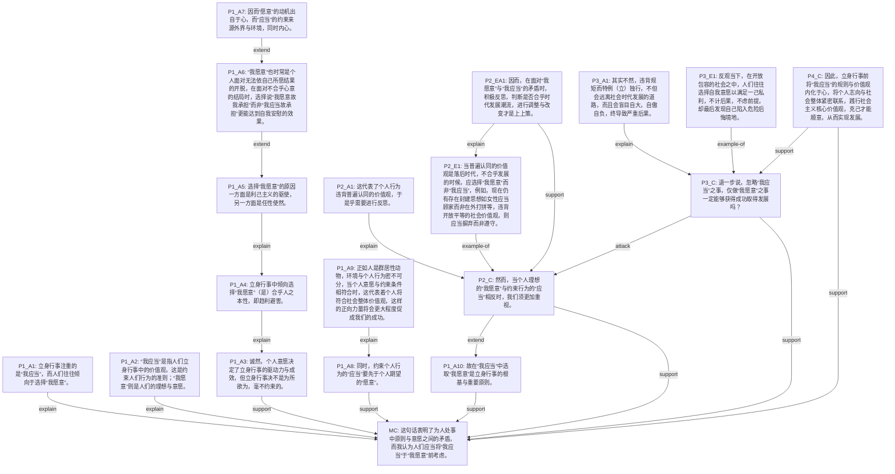

</details>

---

### e02_quzhai_yaoyuan: 未知

**作文题目**：未知  |  **档次**：未知

**论证结构总结**：本文采用总-分-总与层层递进相结合的论证结构。首先提出中心论点：'我应当'与'我愿意'的冲突永恒存在，我们始终处在求索的道路上。然后从六个角度展开论证：第二段讨论遵循'我应当'导致不快乐，从而选择'我愿意'；第三段以'当然'转折，指出'我愿意'需要'我应当'约束；第四段以历史事例论证冲突永恒存在；第五段以'此外'并列，讨论两者的两面性；第六段进一步讨论难以跳出'我应当'的现实困境，但最终仍需求索；第七段以'其实'转折，提出主体性在于寻找个人叙事，升华主题。全文通过正反对比、历史与现实交织，层层深入，最终回归到人的主体性追求。

**节点统计**：28 个节点  |  analysis: 8, evidence: 7, evidence_analysis: 6, major_claim: 1, paragraph_claim: 6
**关系统计**：33 条边  |  attack: 2, example-of: 7, explain: 12, extend: 3, parallel: 1, support: 8

<details>
<summary><b>节点详情</b></summary>

| ID | 类型 | 内容 |
|----|------|------|
| MC | major_claim | 我认为，“我应当”与“我愿意”的冲突永恒存在，我们始终处在求索的道路上。 |
| P2_C | paragraph_claim | 然而，个人遵循“我应当”，按部就班上学工作、结婚生子，过着看似稳定和美好的生活，做的事情却不是“我愿意”的。 |
| P2_A1 | analysis | 人是有一颗心的动物，如果没有内在的“我愿意”，外人看来的岁月静好并不能带给个人真正的快乐。 |
| P2_A2 | analysis | 个人开始叩问自己的内心：我到底怎样活着才对得起这只有一次的人生？ |
| P2_A3 | analysis | 如果没有为自己的梦想活过，晚年回首往事时，会不会充满了遗憾和不甘？ |
| P2_E1 | evidence | 于是人们倾向于选择“我愿意”，比如斯特里克兰德义无反顾地去做画家，公务员抛弃一切去做享受大自然的摄影师。 |
| P2_EA1 | evidence_analysis | 个人选择放弃社会规训下的种种后天标签，只是去追求内心的自由和丰盈，追寻“我愿意”的旷野，释放自己的生命活力。 |
| P3_C | paragraph_claim | 当然，“我愿意”还可能会演变成盲目满足自己的欲望和冲动，即弗洛伊德所说的极端“本我”，这时候就必须用超我的“我应当”来约 |
| P3_A1 | analysis | 超我是人格结构中代表理想的部分，是个体在成长过程中通过内化道德规范和社会价值观形成的。 |
| P3_E1 | evidence | 如果自我没有用超我约束本我的“我愿意”，就会出现道林·格雷的悲剧。 |
| P3_EA1 | evidence_analysis | 他追求极端的“我愿意”，主张及时享乐，从一个纯真少年变成了一具为满足本能欲望而出卖灵魂的腐朽躯壳。 |
| P4_C | paragraph_claim | 本质上，“我应当”和“我愿意”、现实与理想、超我和本我的冲突永恒存在。 |
| P4_A1 | analysis | 回望历史，古代文人常常徘徊在仕与隐的矛盾。 |
| P4_E1 | evidence | 我应当不辜负父祖期许，投身仕途，致君尧舜、济世安民。 |
| P4_E2 | evidence | 但我更愿意“小舟从此逝，江海寄余生”。 |
| P4_EA1 | evidence_analysis | 于是出现了许浑的“帝乡明日到，犹自梦渔樵”，明天就要去朝廷做官了，还梦到渔樵的隐居安逸。 |
| P5_C | paragraph_claim | 此外，“我应当”的轨道不只有桎梏的一面，也能遮风避雨、保暖御寒。 |
| P5_A1 | analysis | “我愿意”的旷野并不是只有繁花盛开，也有尘土飞扬和未知风险。 |
| P5_E1 | evidence | 个人选择了我愿意，选择了没有答案的人生和伍尔夫所言“草原上飞舞的韵律”，也会面临无穷的困惑与无尽的迷茫。 |
| P5_EA1 | evidence_analysis | 因为这条我愿意的道路上，并没有设定好的规则，也没有前人留下的轨迹，个人只能素履以往，踽踽独行。 |
| P6_C | paragraph_claim | 我们很难真的跳出“我应当”，毕竟社会高速运行到现在，已经构筑起严密的轨道，把每个人安置在其中，以求稳固高效。 |
| P6_E1 | evidence | 就像大家都厌倦了上班的庸常重复，但也鲜有人选择创业。 |
| P6_A1 | analysis | 另外，选择“我愿意”后就真的从此无忧无虑了吗？ |
| P6_E2 | evidence | 许多人选择去有风的地方，“兰叶春葳蕤，桂华秋皎洁”。却远离亲友、生活不便，开始的“我愿意”变得不愿意起来。 |
| P6_A2 | analysis | 但人之为人的鲜活，就在于不僵化、不麻木，能感受到束缚和痛楚，也在于我们心中有欲求、有自我要成全。 |
| P6_EA1 | evidence_analysis | 所以，还是要去求索，还是偶尔想纵身一跃，追寻内心的声音。 |
| P7_C | paragraph_claim | 其实不管是“我应当”，还是“我愿意”，都只是一种叙事，而自我的主体性在于寻找独属于个人的叙事，如贺拉斯所言:“无论风暴将 |
| P7_EA1 | evidence_analysis | 即使终将疲倦无力，纵然前方迷雾弥漫，也要用伤痕累累的双手，去摘，遥不可及的星。 |

</details>

<details>
<summary><b>论证树</b></summary>

```
MC
├── P2_C [support]
│   ├── P2_A1 [explain]
│   ├── P2_A2 [extend]
│   ├── P2_A3 [extend]
│   ├── P2_E1 [example-of]
│   │   └── P2_EA1 [explain]
├── P3_C [support]
│   ├── P3_A1 [explain]
│   ├── P3_E1 [example-of]
│   │   └── P3_EA1 [explain]
├── P4_C [support]
│   ├── P4_A1 [explain]
│   ├── P4_E1 [example-of]
│   ├── P4_E2 [example-of]
│   └── P4_EA1 [explain]
├── P5_C [support]
│   ├── P5_A1 [explain]
│   ├── P5_E1 [example-of]
│   │   └── P5_EA1 [explain]
├── P6_C [support]
│   ├── P6_E1 [example-of]
│   ├── P6_A1 [extend]
│   ├── P6_E2 [example-of]
│   ├── P6_A2 [explain]
│   └── P6_EA1 [explain]
└── P7_C [support]
    └── P7_EA1 [support]
```

</details>

<details>
<summary><b>Mermaid 论证图</b></summary>

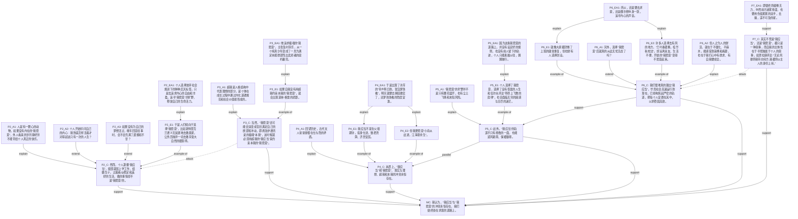

</details>

---

### e03_tongyi_yiyuan: 未知

**作文题目**：未知  |  **档次**：未知

**论证结构总结**：本文采用总-分-总的结构。首先在P1引出'我应当'与'我愿意'的矛盾现象，然后在P2-P3分别分析'我应当'背后的社会价值体系和'我愿意'背后的个人价值体系，揭示两者冲突的本质。P4提出需要辨识两个问题，P5通过年轻人'愿意'清单的具体事例说明'愿意'最终让位于'应当'的现实。P6转折强调'愿意'需要'应然'支撑，P7提出具体解决方案：吸纳'应当'标准并做出符合意愿的选择，最终在MC总结全文，提出统一个人价值体系与社会价值体系、寻找平衡点的中心论点。

**节点统计**：24 个节点  |  analysis: 16, evidence: 1, major_claim: 1, paragraph_claim: 6
**关系统计**：21 条边  |  example-of: 1, explain: 13, extend: 1, support: 6

<details>
<summary><b>节点详情</b></summary>

| ID | 类型 | 内容 |
|----|------|------|
| MC | major_claim | 立身行事，统一个人价值体系与社会价值体系，在时代变迁的大流中寻找理性应然与感性愿意的平衡点。 |
| P1_S1 | analysis | 在社会上常存在这样的现象：人们往往倾向于选择所愿意做的，而不是他们所应当做的。 |
| P1_S2 | analysis | 立身行事的初衷与结果存在这样的矛盾，不禁引发我深思背后的逻辑。 |
| P2_C | paragraph_claim | 由此来看，“我应当”的背后，是整个沉甸甸的社会价值体系对个人价值观的影响力。 |
| P2_A1 | analysis | 什么是应当做的？ |
| P2_A2 | analysis | 应然之事往往与众所认可的道理与规律紧密联系的。 |
| P2_A3 | analysis | “我应当”通常引向的是正确的，主流的做法。 |
| P2_A4 | analysis | 应然之事的正确性是由社会中的前人以千万的经验通过实践证明得来的。 |
| P3_C | paragraph_claim | 我认为，“我愿意”的背后是完整的个人价值体系。 |
| P3_A1 | analysis | 什么是愿意做的？ |
| P3_A2 | analysis | 顺从自己的本意，不过多考虑外界压力因素，而只力求使自己心理舒坦愉悦的做法。 |
| P3_A3 | analysis | 立身行事的过程中，人们更多倾向于选择听从自己的内心欲望而不顾外界社会一套“应然正确”的行为标准，恰恰反映了现代社会中，人 |
| P4_C | paragraph_claim | 要解决这个问题，首先我们需辨识清楚，“我应当”究竟在多大程度上是真正正确，利于我们积极正面发展的？ |
| P4_A1 | analysis | “我愿意”又是否含有一定的执念与偏执？ |
| P5_C | paragraph_claim | 我们需要承认，社会仍在这样的体系下健康运转，而选择愿意做的那一列长清单中一项的人们，最终大多是放弃了最初“愿意”的选项， |
| P5_E1 | evidence | 对于远方与未来无限可能性的期盼，使年轻人对于“意愿”之事列出常常的一份清单：我愿意从事电竞游戏主播行业；我愿意当网红赚流 |
| P5_A1 | analysis | 身处快节奏发展，错综复杂的社会中，日以继夜如潮流般汹涌而来的资讯与观点冲涮着年轻一代的头脑。 |
| P5_A2 | analysis | 然而与此同时，社会仍秉持着几十年来不变的一套依靠优胜实在进入职场的价值体系。 |
| P6_C | paragraph_claim | 然而“愿意”之事若无坚实的“应然”价值体系的支撑，便也只是空中楼阁，最终止步于“我愿意”的空想阶段。 |
| P6_A1 | analysis | 随时代变迁，价值观念的新旧冲突不可避免。 |
| P7_C | paragraph_claim | 这样，“我愿意”的选项，才得以成为正确与持久的那个。 |
| P7_A1 | analysis | 在世事变迁的时代，我们需要做的，正是踏实诚恳地吸纳并认可老一辈经验所奠积（基）出的“应当”做的行为标准。 |
| P7_A2 | analysis | 在此基础上，成熟而切实际地做出符合自己主观意愿的选择来。 |
| P7_A3 | analysis | 既要“守旧”，守正确的应然之理，又要“创新”，创新颖的时代之感。 |

</details>

<details>
<summary><b>论证树</b></summary>

```
MC
├── P2_C [support]
│   ├── P2_A1 [explain]
│   ├── P2_A2 [explain]
│   ├── P2_A3 [explain]
│   └── P2_A4 [explain]
├── P3_C [support]
│   ├── P3_A1 [explain]
│   ├── P3_A2 [explain]
│   └── P3_A3 [explain]
├── P4_C [support]
│   └── P4_A1 [extend]
├── P5_C [support]
│   ├── P5_E1 [example-of]
│   ├── P5_A1 [explain]
│   └── P5_A2 [explain]
├── P6_C [support]
│   └── P6_A1 [explain]
└── P7_C [support]
    ├── P7_A1 [explain]
    ├── P7_A2 [explain]
    └── P7_A3 [explain]
```

</details>

<details>
<summary><b>Mermaid 论证图</b></summary>

```mermaid
graph TD
    MC["MC: 立身行事，统一个人价值体系与社会价值体系，在时代变迁的大流中寻找理性应然与感性愿意的平衡点。"]
    P2C["P2_C: 由此来看，“我应当”的背后，是整个沉甸甸的社会价值体系对个人价值观的影响力。"]
    P2A1["P2_A1: 什么是应当做的？"]
    P2A2["P2_A2: 应然之事往往与众所认可的道理与规律紧密联系的。"]
    P2A3["P2_A3: “我应当”通常引向的是正确的，主流的做法。"]
    P2A4["P2_A4: 应然之事的正确性是由社会中的前人以千万的经验通过实践证明得来的。"]
    P3C["P3_C: 我认为，“我愿意”的背后是完整的个人价值体系。"]
    P3A1["P3_A1: 什么是愿意做的？"]
    P3A2["P3_A2: 顺从自己的本意，不过多考虑外界压力因素，而只力求使自己心理舒坦愉悦的做法。"]
    P3A3["P3_A3: 立身行事的过程中，人们更多倾向于选择听从自己的内心欲望而不顾外界社会一套“应然正确”的行为标准，恰恰反映了现代社会中，人们个人价值体系时常会与社会价值体系相冲撞矛盾。"]
    P4C["P4_C: 要解决这个问题，首先我们需辨识清楚，“我应当”究竟在多大程度上是真正正确，利于我们积极正面发展的？"]
    P4A1["P4_A1: “我愿意”又是否含有一定的执念与偏执？"]
    P5C["P5_C: 我们需要承认，社会仍在这样的体系下健康运转，而选择愿意做的那一列长清单中一项的人们，最终大多是放弃了最初“愿意”的选项，拾起“应当”的选项，长久立身行事。"]
    P5E1["P5_E1: 对于远方与未来无限可能性的期盼，使年轻人对于“意愿”之事列出常常的一份清单：我愿意从事电竞游戏主播行业；我愿意当网红赚流量，宅家饭来张口衣来伸手；我愿意尝试通过各大综艺媒体，一夜成名……"]
    P5A1["P5_A1: 身处快节奏发展，错综复杂的社会中，日以继夜如潮流般汹涌而来的资讯与观点冲涮着年轻一代的头脑。"]
    P5A2["P5_A2: 然而与此同时，社会仍秉持着几十年来不变的一套依靠优胜实在进入职场的价值体系。"]
    P6C["P6_C: 然而“愿意”之事若无坚实的“应然”价值体系的支撑，便也只是空中楼阁，最终止步于“我愿意”的空想阶段。"]
    P6A1["P6_A1: 随时代变迁，价值观念的新旧冲突不可避免。"]
    P7C["P7_C: 这样，“我愿意”的选项，才得以成为正确与持久的那个。"]
    P7A1["P7_A1: 在世事变迁的时代，我们需要做的，正是踏实诚恳地吸纳并认可老一辈经验所奠积（基）出的“应当”做的行为标准。"]
    P7A2["P7_A2: 在此基础上，成熟而切实际地做出符合自己主观意愿的选择来。"]
    P7A3["P7_A3: 既要“守旧”，守正确的应然之理，又要“创新”，创新颖的时代之感。"]

    P2C -->|support| MC
    P2A1 -->|explain| P2C
    P2A2 -->|explain| P2C
    P2A3 -->|explain| P2C
    P2A4 -->|explain| P2C

    P3C -->|support| MC
    P3A1 -->|explain| P3C
    P3A2 -->|explain| P3C
    P3A3 -->|explain| P3C

    P4C -->|support| MC
    P4A1 -->|extend| P4C

    P5C -->|support| MC
    P5E1 -->|example-of| P5C
    P5A1 -->|explain| P5C
    P5A2 -->|explain| P5C

    P6C -->|support| MC
    P6A1 -->|explain| P6C

    P7C -->|support| MC
    P7A1 -->|explain| P7C
    P7A2 -->|explain| P7C
    P7A3 -->|explain| P7C
```

</details>

**⚠️ 一致性问题**：
  - 孤立节点: ['P1_S2', 'P1_S1']

---

### e04_beixuyao: 未知

**作文题目**：未知  |  **档次**：未知

**论证结构总结**：本文采用总-分-总的论证结构。首先提出中心论点：请理性看待“被需要”，并从正面阐述“被需要”的积极意义（通过马斯洛理论和鲁迅名言论证其构建社会联系、实现自我价值的作用）。然后以“但是”转折，从反面论证盲目狂热的危害，通过瑞德、东郭先生、堂吉诃德、沙威等事例警示需理性分析被需要的本质。最后总结升华，重申“没有人是一座孤岛”，呼吁在理性分析后于被需要中成就价值。

**节点统计**：16 个节点  |  analysis: 4, evidence: 5, evidence_analysis: 4, major_claim: 1, paragraph_claim: 2
**关系统计**：15 条边  |  attack: 1, example-of: 5, explain: 4, extend: 2, support: 3

<details>
<summary><b>节点详情</b></summary>

| ID | 类型 | 内容 |
|----|------|------|
| MC | major_claim | 请理性看待“被需要”人是社会的人，正如约翰·多恩曾言“没有人是一座孤岛”，每个人不可避免地会与他人在社会生活中与他人产生 |
| P1_A1 | analysis | 人们既要通过自身努力，也要通过他人帮助来实现自身需要；同时也时常渴望被他人需要，以体现自己的价值。 |
| P1_A2 | analysis | 在“需要”与“被需要”之间，“被需要”往往被认为是更高层次的“需要”。 |
| P1_E1 | evidence | 美国心理学家马斯洛就在《人类激励理论》一书中将人类的需要等级分为五个层次，即生理、安全、社交、尊重、自我实现五种需求。 |
| P1_EA1 | evidence_analysis | 其中，尊重需求和自我实现需求属于需要的最高层次，人只有在社会生活充分发挥自己的作用，被别人需要，才能得到世人的认可与尊重 |
| P1_A3 | analysis | 人们对尊重，对实现自我价值的期盼无疑是好的，是对他人与社会有着重要意义的。 |
| P1_EA2 | evidence_analysis | 当人们渴望被他人需要，以体现自己的价值时，便会自发地去寻找他人的需要，这就构建了人与人关系的桥梁，使“孤岛”连成了“大陆 |
| P2_C | paragraph_claim | 但是我们也应当理性分析被需要的诉求为先，面对被他人所需要不可盲目，狂热。 |
| P2_E1 | evidence | 石黑雄笔下的瑞德一味去应付别人那些仅仅为了偷懒的小忙，却最后忘却了自己。 |
| P2_E2 | evidence | 东郭先生滥施同情和怜悯，反险遭凶残而狡猾的中山狼恩将仇报。 |
| P2_A1 | analysis | 也需要警惕“在光明中失明”的现象，居高临下、救世主般地帮助着自以为需要被帮助的人其实是种伤害。 |
| P2_E3 | evidence | 堂吉诃德虽然拥有着一个真正的骑士所拥有的所有美德，但是有时其自诩正义的帮助却实际上令人啼笑皆非。 |
| P2_E4 | evidence | 沙威虽然刚正无私地恪守法律，却不懂得变通，自以为是帮助百姓除恶，却摧折了真正的善良。 |
| P2_EA1 | evidence_analysis | 由此可见，在急于满足所谓的他人需要、体现所谓的自我价值之前，我们应当首先明辨这种需要的本质与初衷，只有这种被他人需要的渴 |
| P3_C | paragraph_claim | 没有人是一座孤岛。 |
| P3_EA1 | evidence_analysis | 愿所有人能在理性分析真正的需要之后，于被需要之中成就自己的的价值。 |

</details>

<details>
<summary><b>论证树</b></summary>

```
MC
├── P1_A1 [explain]
│   └── P1_A2 [extend]
│       └── P1_E1 [example-of]
│           └── P1_EA1 [explain]
│               └── P1_A3 [extend]
│                   └── P1_EA2 [support]
├── P2_C [attack]
│   ├── P2_E1 [example-of]
│   ├── P2_E2 [example-of]
│   ├── P2_A1 [explain]
│   │   ├── P2_E3 [example-of]
│   │   └── P2_E4 [example-of]
│   └── P2_EA1 [support]
└── P3_C [support]
    └── P3_EA1 [explain]
```

</details>

<details>
<summary><b>Mermaid 论证图</b></summary>

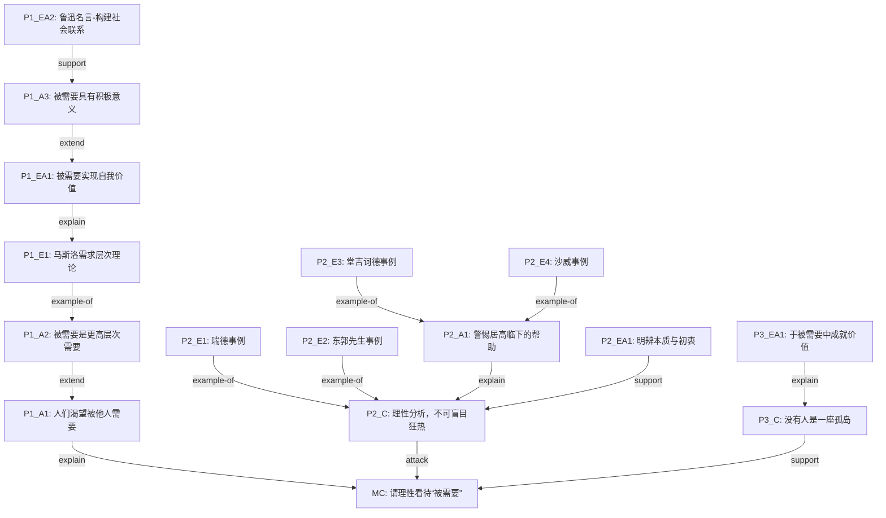

</details>

---

### e05_wanfeng_guoyan: 未知

**作文题目**：未知  |  **档次**：未知

**论证结构总结**：本文采用总-分-总递进式论证结构。首先提出中心论点：博览群书后会对自己的根和价值拥有更主动真诚的认同。然后从五个层面递进展开：第二段论证比较是认识事物的基础，第三段延伸至博闻形成主体性，第四段总结博闻使人客观认识，第五段补充开放自我的条件，第六段深化为动态吸收。最后第七段总结，强调不变的是对根的认同。全文层层递进，逻辑严密。

**节点统计**：16 个节点  |  analysis: 4, evidence: 3, evidence_analysis: 2, major_claim: 1, paragraph_claim: 6
**关系统计**：20 条边  |  example-of: 3, explain: 6, extend: 5, support: 6

<details>
<summary><b>节点详情</b></summary>

| ID | 类型 | 内容 |
|----|------|------|
| MC | major_claim | 而博览群书，知晓众人长，也必定会对自己的“根”，对心中的价值，拥有比别人更主动、更真诚的认同。 |
| P2_C | paragraph_claim | 我们都是在比较之中，生发出对事物的感知与评判。 |
| P2_E1 | evidence | 王充的“两刃相割，利钝乃知，两论相驳，是非乃定”便是一例，通过比较，事物各自特点凸显，优劣立分，是非昌明。 |
| P2_EA1 | evidence_analysis | “比较”实在是我们认识事物的一把利器。 |
| P3_C | paragraph_claim | 虽然“博闻”也不一定是比较，然而我向之所言，已带了主观的评判色彩，博闻本身使人丰富自我而并非无倾向，只是看到千万书卷，万 |
| P3_A1 | analysis | “万种风烟之后”我之主体性方才显现，若是腹中空空，那么所谓认识与观点，自然基于空想，流于浅薄。 |
| P4_C | paragraph_claim | 由是观之，我们要真正做到“博闻”才能真正客观地认识事物，所谓“操千曲而后晓声，观千剑而后识器”便是此意。 |
| P4_EA1 | evidence_analysis | 在观“千剑”之后，形成对良器的判断，这便是博闻的作用了。 |
| P5_C | paragraph_claim | 而所谓的博闻，与博闻中的比较，都需要一个开放的自我。 |
| P5_A1 | analysis | 否则会“井底之蛙”囿于身，失去了对外物的比较和借鉴，将会丢失自我的判断与认同。 |
| P5_A2 | analysis | 只有足够开阔的胸襟，执着的坚持，敢于突破，才能形成自身的认识。 |
| P5_E1 | evidence | 如冯友兰先生学贯中西，却终身致力于“阐旧邦以辅新命”，正是以为他在博采世界文化之众长后，更深刻地理解与认同了中国文化，他 |
| P6_C | paragraph_claim | 比较之后得到自己认同的价值，我们也不能抱守不放，而更要动态吸收，博采众长，才能算真正认识了事物。 |
| P6_A1 | analysis | 万种风烟过眼后，有人得出“巫山之云最美”，便拒绝欣赏别处的美，我们大约都会觉得可惜、可叹。 |
| P6_E1 | evidence | 正如有人喜欢“中国味”音乐，而中国音乐也是文化交融、动态发展的，琵琶、扬琴、二胡……古时的异域风情，如今也成了正牌“民乐 |
| P7_C | paragraph_claim | 正所谓，万种风烟过眼后，心中最美景，还是随时变，只是那份不变的，是根，是魂，是自我对它发自内心的认同。 |

</details>

<details>
<summary><b>论证树</b></summary>

```
MC
├── P2_C [support]
│   └── P2_E1 [example-of]
│       └── P2_EA1 [explain]
├── P3_C [support]
│   ├── P3_A1 [explain]
│   └── (extends from P2_C)
├── P4_C [support]
│   ├── P4_EA1 [explain]
│   └── (extends from P3_C)
├── P5_C [support]
│   ├── P5_A1 [explain]
│   ├── P5_A2 [explain]
│   ├── P5_E1 [example-of]
│   └── (extends from P4_C)
├── P6_C [support]
│   ├── P6_A1 [explain]
│   ├── P6_E1 [example-of]
│   └── (extends from P5_C)
└── P7_C [support]
    └── (extends from P6_C)
```

</details>

<details>
<summary><b>Mermaid 论证图</b></summary>

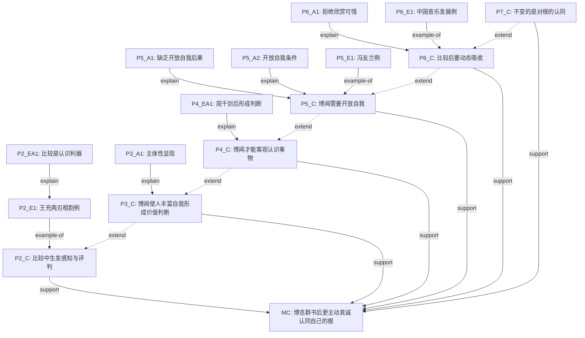

</details>

---

### e06_tansuo_buluting: 未知

**作文题目**：未知  |  **档次**：未知

**论证结构总结**：本文采用总-分-总与递进式相结合的论证结构。首先通过加来道雄的趣事引出好奇心对探索的触发作用（P1），然后分两层：先肯定好奇心的基础作用（P2），再指出其局限性（P3），从而引出中心论点——探索的多元动力（MC）。接着从四个递进维度展开论证：物质激励（P4）→个人价值实现（P5）→群体信念（P6）→时代召唤（P7），段间以'进而''更进一步''不止如此'形成递进关系。最后引用屈原诗句总结全文，呼应开头，强调探索始于好奇而超越好奇，最终通达真理。

**节点统计**：25 个节点  |  analysis: 6, evidence: 8, evidence_analysis: 4, major_claim: 1, paragraph_claim: 6
**关系统计**：32 条边  |  example-of: 6, explain: 10, extend: 5, support: 11

<details>
<summary><b>节点详情</b></summary>

| ID | 类型 | 内容 |
|----|------|------|
| MC | major_claim | 故而，一个人之所以乐意去孜孜不倦地探索陌生的世界，并非仅仅是好奇心的作用。 |
| P1_S1 | evidence | 物理学家加来道雄在自传中记叙了儿时观察池中鲤鱼的趣事，彼时的一份好奇成为他日后用以打开物理学大门的钥匙。 |
| P1_S2 | analysis | 好奇心促使人们走上探索陌生与未知世界的旅途。 |
| P2_C | paragraph_claim | 好奇是人类与生俱来的本能，我们在好奇心驱使下认知世界万物，形成思维体系，实现社会层面的成熟。 |
| P2_A1 | analysis | 好奇心于人，便如燃油之于车辆，助力我们在求知求真的漫漫远道上迈出第一步。 |
| P3_C | paragraph_claim | 突然萌发的好奇心固然可以使个体开启探索的篇章，却难以成为支撑他一路向前的永恒动力。 |
| P3_A1 | analysis | 然而，探索之路道阻且长，遥遥似无尽头。 |
| P3_A2 | analysis | 与此同时，好奇者探索未知的目的往往是解答心中某个问题，因而，当他获取该问题的答案之后，便自认为到达了认知的终点，其探索之 |
| P4_C | paragraph_claim | 一个人可能因物质财富或声名利禄的激励而向未知进发。 |
| P4_E1 | evidence | 西欧大航海时代中，航海家们扬起船舶驶向新大陆，驶向无穷的宝藏，驶向富饶的土地，驶向史上第一人的光环。 |
| P4_EA1 | evidence_analysis | 尽管此种探索的动机未免流于功利化，但它有其独特的意义——世界各地的联系由此更加紧密。 |
| P5_C | paragraph_claim | 进而，探索陌生世界亦是在拓展个人生活的边界，突破眼下环境的枯燥与单调。 |
| P5_E1 | evidence | 马斯洛的需求金字塔向我们揭示：人渴望通过实现个人价值来满足精神需求。 |
| P5_E2 | evidence | 而探索未知正是一展宏图的绝佳赛道，浮士德为获取重新探索人生的机会，不惜用灵魂和魔鬼做交易，充盈而跌宕的生命吸引着他。 |
| P5_E3 | evidence | 正如毛姆所言：人就应该赴汤蹈火，履险如夷。 |
| P5_EA1 | evidence_analysis | 遨游于未知，人们收获精神层面的刺激与满足，便乐于向更远处进发。 |
| P6_C | paragraph_claim | 更进一步，探索陌生世界远非个人的事业，其上寄托着群体的信念与坚守。 |
| P6_E1 | evidence | 探界者钟杨一次又一次向世界屋脊进发，为名？为利？非也！ |
| P6_EA1 | evidence_analysis | 他的探索之途上凝结着植物学家们建成世界种子基因库的愿望，更彰显一名学者以实践求真知的使命感。 |
| P6_A1 | analysis | 探索，已成向真理的朝圣之旅。 |
| P7_C | paragraph_claim | 不止如此，人们坚定地向陌生走去，亦是在响应时代的召唤。 |
| P7_E1 | evidence | 詹天佑等人在晚清时期来到陌生的大洋彼岸求学，正是为了开辟一条救亡图存的大道，秉持着鲁迅先生所说“无穷的远方，无尽的人们， |
| P7_EA1 | evidence_analysis | 于古如是，于今亦然。 |
| P7_A1 | analysis | 当今的我们理应摆出探索未知的昂扬姿态，去实现个人之志，彰群体的信念，扬时代风帆。 |
| P8_S1 | evidence | 屈原在江畔行吟：吾将上下而求索，何惧道路之修远，让我们的探索之途因好奇而始，绵延千里，通达真理！ |

</details>

<details>
<summary><b>论证树</b></summary>

```
MC
├── P2_C [support]
│   └── P2_A1 [explain]
├── P3_C [support]
│   ├── P3_A1 [explain]
│   └── P3_A2 [explain]
├── P4_C [support]
│   ├── P4_E1 [example-of]
│   │   └── P4_EA1 [explain]
│   └── P4_EA1 [support]
├── P5_C [support]
│   ├── P5_E1 [example-of]
│   ├── P5_E2 [example-of]
│   ├── P5_E3 [example-of]
│   └── P5_EA1 [explain] → P5_E1, P5_E2, P5_E3
│   └── P5_EA1 [support]
├── P6_C [support]
│   ├── P6_E1 [example-of]
│   │   └── P6_EA1 [explain]
│   ├── P6_EA1 [support]
│   └── P6_A1 [extend]
├── P7_C [support]
│   ├── P7_E1 [example-of]
│   │   └── P7_EA1 [explain]
│   ├── P7_EA1 [support]
│   └── P7_A1 [extend]
└── P8_S1 [support]

段间关系（延伸链）：
P4_C → P5_C [extend]
P5_C → P6_C [extend]
P6_C → P7_C [extend]
```

</details>

<details>
<summary><b>Mermaid 论证图</b></summary>

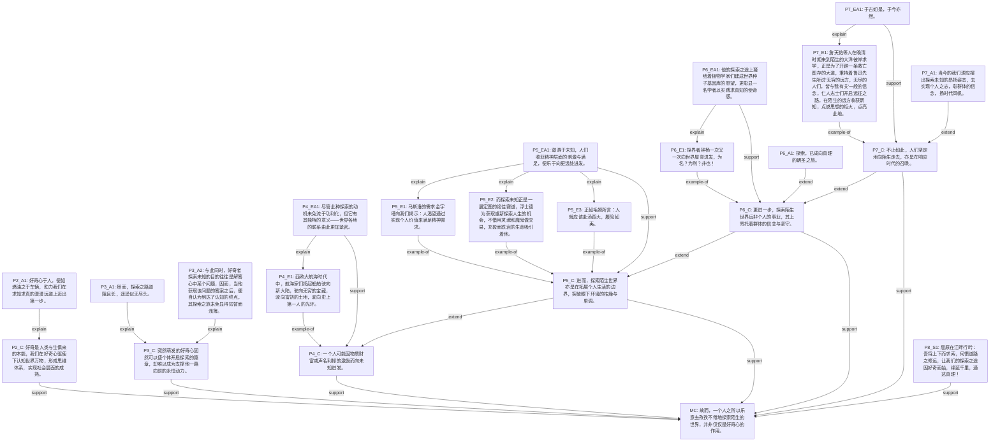

</details>

**⚠️ 一致性问题**：
  - 未连接 Claim 的 Evidence/EA: ['P1_S1']

---

### e07_yongyu_tansuo: 未知

**作文题目**：未知  |  **档次**：未知

**论证结构总结**：本文采用总-分-总的结构。首段以悉达多故事引入话题，提出探索陌生世界的普遍性。中心论点位于末段：愿我们在探索中获得充实心灵、达乎自身圆满。主体部分从四个角度展开论证：P2先指出好奇是浅层原因，引出深层力量；P3-P5并列论述三个深层动机——对更广阔舞台的渴求、'向外看'以深化理解、对积极自由的主动选择；P6进一步延伸，讨论探索过程中的意义与勇气，以西西弗斯神话说明斗争本身即可充实心灵。全文层层递进，最终回归到对读者的呼吁。

**节点统计**：29 个节点  |  analysis: 12, evidence: 7, evidence_analysis: 4, major_claim: 1, paragraph_claim: 5
**关系统计**：29 条边  |  attack: 2, example-of: 7, explain: 8, extend: 4, parallel: 3, support: 5

<details>
<summary><b>节点详情</b></summary>

| ID | 类型 | 内容 |
|----|------|------|
| MC | major_claim | 愿我们也能在对陌生的求索中获得充实的心灵，在对勇气的实践中达乎自身圆满。 |
| P1_A1 | analysis | 黑塞笔下的悉达多放弃了生而有之的锦衣玉食的生活，毅然与友人割席，踏上了对陌生世界的探索之途。 |
| P1_A2 | analysis | 从文学回归现实，生活中亦不乏乐意去探索陌生世界之人，他们动机多样，收获各异，在探索中丰盈了自己的人生。 |
| P2_C | paragraph_claim | 陌生往往意味着新奇与未知，好奇也成为了人们探索陌生世界的浅层原因之一。 |
| P2_A1 | analysis | 然而好奇这一情感是轻盈且速朽的，在陌生之途的险阻与重压下，人们往往望而却步。 |
| P2_A2 | analysis | 将好奇扼杀在摇篮中。 |
| P2_A3 | analysis | 而支持人们勇于踏上征途的，必然是一些更为持久与深入的力量。 |
| P3_C | paragraph_claim | 人们对陌生世界的探索包含了对更广阔舞台的渴求。 |
| P3_E1 | evidence | 德里达曾言：“对未知的探索充盈了人类的选择之路。” |
| P3_E2 | evidence | 在当下内卷加剧的时代，越来越多人疲倦于“996”的劳迹，在机器一般的重复与劳作中渴望为生命带来更多的色彩。 |
| P3_E3 | evidence | 因而便有了“世界那么大，我想去看看”的洒脱选择。 |
| P3_EA1 | evidence_analysis | 这不仅是对庸碌现实的扣问与脱离，是对谢尔德林、海德格尔所提倡的“诗意的栖居”的追求，更是对人生旅途的拓展，对生命更丰盈可 |
| P4_C | paragraph_claim | 人乐意去探索陌生世界，还因为人的灵魂渴望“向外看”。 |
| P4_A1 | analysis | 这一“向外看”并不意味着永久求变，也并不意味着人们对既有熟悉事物的背离。 |
| P4_A2 | analysis | 相反，“走出去”是为了更好的“返回来”。 |
| P4_E1 | evidence | 康有为在变法失败后游历欧洲，对西方的启蒙思想与民主政体有了更为深刻的认识，回国后创作了更多文论以启迪时人。 |
| P4_EA1 | evidence_analysis | 有时人们乐意探索陌生世界，是为了深化对既有熟悉之物的理解，在取其精华、为我可用中向更高的层次跃升。 |
| P5_C | paragraph_claim | 对陌生世界的探索亦是因为对积极自由的主动选择。 |
| P5_E1 | evidence | 昆德拉写作《不能承受的生命之轻》，其“轻”在于人生具有无限展开的可能性，我们亦具有探索陌生世界的自由。 |
| P5_A1 | analysis | 但这场自由又是孤独而沉重的，正如悉达多与挚友割席独立踏上旅途。 |
| P5_E2 | evidence | 斯特里克兰为追寻绘画梦想穷苦地旅居异国。 |
| P5_EA1 | evidence_analysis | 但他们都因灵魂对本真追求的呼唤而踏上了征程，这是一种承担“生命之轻”的勇气，也是对自我主体性的坚守。 |
| P6_C | paragraph_claim | 我们动身出发，探索陌生世界，均对这段未知的旅途充满愿景，渴望从中寻得意义与答案。 |
| P6_A1 | analysis | 但正如存在主义哲学所勾勒的无意义的前景，我们在陌生的求索中可能注定会历经磨难，可能一无所获。 |
| P6_A2 | analysis | 但这又如何？ |
| P6_A3 | analysis | 既然有选择的自由，既然有勇气拥抱生命中战败的奔流，那么就去做，并为此负责。 |
| P6_E1 | evidence | 正如探索陌生世界之途中，我们每个人都是西西弗斯。 |
| P6_EA1 | evidence_analysis | 但恰如加缪所言，“西西弗斯是幸福的”，因为“登上顶峰的斗争足以充实人的心灵”。 |
| P7_A1 | analysis | 悉达多在历经求索后，在河边与友人重逢，并领悟了生命的真正奥义。 |

</details>

<details>
<summary><b>论证树</b></summary>

```
MC
├── P2_C [support]
│   ├── P2_A1 [explain]
│   │   └── P2_A2 [extend]
│   └── P2_A3 [extend]
├── P3_C [support]
│   ├── P3_E1 [example-of]
│   ├── P3_E2 [example-of]
│   ├── P3_E3 [example-of]
│   │   └── P3_EA1 [explain]
│   └── [parallel] P2_C
├── P4_C [support]
│   ├── P4_A1 [explain]
│   │   └── P4_A2 [extend]
│   ├── P4_E1 [example-of]
│   │   └── P4_EA1 [explain]
│   └── [parallel] P3_C
├── P5_C [support]
│   ├── P5_E1 [example-of]
│   ├── P5_A1 [explain]
│   ├── P5_E2 [example-of]
│   │   └── P5_EA1 [explain]
│   └── [parallel] P4_C
└── P6_C [support]
    ├── P6_A1 [attack]
    │   ├── P6_A2 [attack]
    │   │   └── P6_A3 [explain]
    ├── P6_E1 [example-of]
    │   └── P6_EA1 [explain]
    └── [extend] P5_C
```

</details>

<details>
<summary><b>Mermaid 论证图</b></summary>

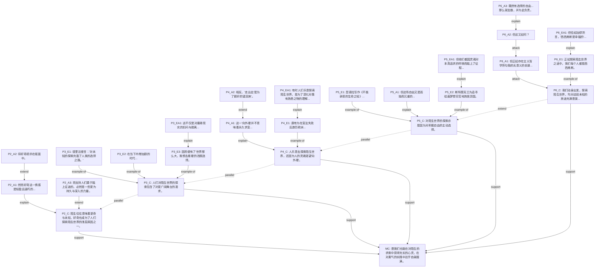

</details>

**⚠️ 一致性问题**：
  - 孤立节点: ['P7_A1', 'P1_A2', 'P1_A1']

---

### e08_zhuan_zhuan_chuan: 未知

**作文题目**：未知  |  **档次**：未知

**论证结构总结**：本文采用总-分-总结构，以让步递进的方式展开论证。首先提出中心论点：由专到传未必需要经过转。然后分三层论证：第一层（P2）界定三类文章概念，为论证奠定基础；第二层（P3）让步承认转的积极作用，以《西游记》为例；第三层（P4-P5）从反面论证转非必要条件，以《查拉图斯特拉如是说》为例，并从字源分析本质区别；最后（P6）反思问题根源在于考核标准变化，并提出提升人的建议。整体呈现'立论-让步-反驳-深化'的论证脉络。

**节点统计**：18 个节点  |  analysis: 9, evidence: 2, evidence_analysis: 1, major_claim: 1, paragraph_claim: 5
**关系统计**：17 条边  |  attack: 1, example-of: 2, explain: 6, extend: 3, support: 5

<details>
<summary><b>节点详情</b></summary>

| ID | 类型 | 内容 |
|----|------|------|
| MC | major_claim | 以我之见，未必。 |
| P2_C | paragraph_claim | 三类文章之名由专字演变，“专”意为专业文章，通常远离日常生活，对读者有认知门槛；“转”是被转发的通俗文章，为迎合读者而做 |
| P2_A1 | analysis | 同样广泛传播，“转”是自我降格迎合读者，“传”则依靠质量以吸引目标受众。 |
| P2_A2 | analysis | 尤其在当下，互联网以其无远弗届的通信能力，使转文的受众更为广泛，不少专业文章为求获取读者注意也作通俗化处理，使“转”充斥 |
| P3_C | paragraph_claim | 不得不承认，“转”的过程有时的确有助于专业文章的传播。 |
| P3_E1 | evidence | 譬如《西游记》成为传世之作的过程中，通俗读本、连环画等虽只是将故事通俗化到片段，但已激起读者阅读原著的兴趣，从而使“专” |
| P4_C | paragraph_claim | 但是，“转”的过程并非必要条件。 |
| P4_A1 | analysis | 首先，为转发专业文章通常要经过通俗化处理，此过程难免对作品作扁平化处理。 |
| P4_E1 | evidence | 更有甚者，会磨灭作品的深刻性、超前性，正如《查拉图斯特拉如是说》在通俗化过程中，必然会消磨作品的深刻性与超前性，反而与“ |
| P4_EA1 | evidence_analysis | 类似这样的专业文章，并不是依靠通俗化而成为传世佳作，而是经历时间沉淀、社会观念的改变，人们才逐渐看见其沙土之下的黄金本色 |
| P4_A2 | analysis | 可见，不少作品从“专”到“传”并不依赖于“转”，“转”更可能会破坏“传”的形式。 |
| P5_C | paragraph_claim | 深究问题本质，这涉及“传”与“转”在考核标准上的区别，不妨从两字偏旁部首考察。 |
| P5_A1 | analysis | 转的“车”字旁意味着其旨在传播过程，“转”的过程则帮助更多的人看到，但并不能帮助人们对专业加深理解，也未必使人们渴望深入 |
| P5_A2 | analysis | 然而，传的“人”字旁则表明传世佳作是以人的真正理解为要求的，单纯追求转发从根本上就与人类真正的理解无关，又谈何必要条件？ |
| P6_C | paragraph_claim | 我想这反映出当代社会考核作品标准的变化，对作品的考核不在于品质，反而是将流量等价于质量，当人们用通俗化抽干作品之河的品质 |
| P6_A1 | analysis | 回归题目，面对如此简单的逻辑便可推翻的问题，缘何会提出如此的疑问呢？ |
| P6_A2 | analysis | 而更深的危机是过度娱乐化导致的思维品质下降，人们让渡对专业作品思考、思辨的机会，最终只落得传世之作消亡于沸反盈天的转发之 |
| P6_A3 | analysis | 或许我们该做的不是降格作品，而是提升作品之外的人，正是在攻克专业作品进道壁垒之时，我们创造了传世佳作的别有洞天。 |

</details>

<details>
<summary><b>论证树</b></summary>

```
MC
├── P2_C [support]
│   ├── P2_A1 [explain]
│   └── P2_A2 [extend]
├── P3_C [attack]
│   └── P3_E1 [example-of]
├── P4_C [support]
│   ├── P4_A1 [explain]
│   ├── P4_E1 [example-of]
│   │   └── P4_EA1 [explain]
│   └── P4_A2 [support]
├── P5_C [support]
│   ├── P5_A1 [explain]
│   └── P5_A2 [explain]
└── P6_C [support]
    ├── P6_A1 [explain]
    ├── P6_A2 [extend]
    └── P6_A3 [extend]
```

</details>

<details>
<summary><b>Mermaid 论证图</b></summary>

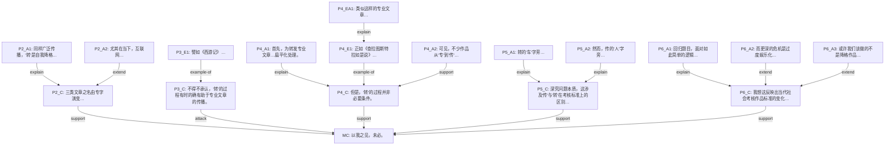

</details>

---

### e09_xinhuai_shengxia: 未知

**作文题目**：未知  |  **档次**：未知

**论证结构总结**：本文采用总-分-总的论证结构。首先提出中心论点：加缪之言是理想主义者在逆境中心怀热忱的自我宣言。然后从三个角度展开论证：第二段反驳'夏虫不可语冰'的质疑，维护论点的合理性；第三段以屈原为例正面论证理想主义者的坚守；第四段进一步深化，指出无畏使夏天更难以战胜；第五段深入反驳'精神胜利法'的质疑；第六段联系当下，批判滥用现象并提出改革方案，最后号召心怀盛夏直面隆冬。全文层层递进，逻辑严密。

**节点统计**：22 个节点  |  analysis: 3, evidence: 7, evidence_analysis: 6, major_claim: 1, paragraph_claim: 5
**关系统计**：24 条边  |  attack: 3, example-of: 4, explain: 3, extend: 2, parallel: 1, support: 11

<details>
<summary><b>节点详情</b></summary>

| ID | 类型 | 内容 |
|----|------|------|
| MC | major_claim | 这不仅是寄情自然的心灵独白、逆境中坚守的希望，更是理想主义者在风雪岁月中，心怀热忱的自我宣言。 |
| P1_A1 | analysis | 加缪之言：“在隆冬，我终于明白，我身上有一个不可战胜的夏天。” |
| P1_A2 | analysis | 究其概念，“隆冬”乃指挫折、困境、绝望与黑暗包围的时刻，“夏天”则是与之抗衡的勇气、爱、希望与光明，“不可战胜”一词，揭 |
| P2_C | paragraph_claim | 这无疑脱离了实际！ |
| P2_E1 | evidence | 或许有人借《庄子·秋水》之言发难：“夏虫不可语冰，井蛙不可语海。” |
| P2_E2 | evidence | 既身处隆冬，如何知晓夏天的存在与不可战胜？ |
| P2_EA1 | evidence_analysis | 诚然，“夏虫”与“井蛙”皆受环境限制而无法见到广阔天地、远山沧海，但将此二者与具有主观能动性的人类相比，便是犯了轻率归纳 |
| P3_C | paragraph_claim | 屈原给了我们答案。 |
| P3_A1 | analysis | 当理想悬于九天之上，当肉身困于尘世泥柳，一个人该如何自处？ |
| P3_E1 | evidence | 在“谗人间之”的隆冬，在“信而见疑、忠而被谤”的隆冬，他并未选择同流于世俗，以邪曲之言博取帝心，而是深切地关心着百姓，宁 |
| P3_EA1 | evidence_analysis | 即使肉身消散，其如鸷鸟般的精神，便是屈原身上不可被战胜的夏天。 |
| P4_C | paragraph_claim | 进一步说，真正的勇士、坚守的理想主义者，或许在面对残酷的风雪之时，已做好了牺牲于此也不愿屈服的准备，这份无畏，使夏天拥有 |
| P4_E1 | evidence | 鲁迅先生痛斥《二十四孝图》扭曲孝道时，写下“即使坠入地狱也绝不反悔”的誓言，在封建主义的隆冬中，这份对吾土吾民深沉的爱， |
| P5_C | paragraph_claim | 非也！ |
| P5_E1 | evidence | 而更深处看，也许有人抛出更尖锐的提问：这句话是否是隆冬里的人宽慰自身的“精神胜利法”？ |
| P5_EA1 | evidence_analysis | 逃避隆冬的阿Q式的人，绝不会自发喊出如此充满勇气与力量的话语，被扭曲了价值体系的精神胜利者，甚至难以察觉自己身处隆冬，而 |
| P5_EA2 | evidence_analysis | 而唯有如尼采所言“命运之爱”那般清醒地面对人生，才能审视于逆境之中，永不磨灭的希望之光，背负起一个不可战胜的夏天。 |
| P6_C | paragraph_claim | 心怀盛夏，坚守内心的那一线天光，直面隆冬，又何妨？ |
| P6_E1 | evidence | 反观当下，确有人囫囵吞枣般以加缪之言作为精神安慰剂，各大社交平台上对这句话的摘抄转发层出不穷，可究竟有多少人于屏幕的浮光 |
| P6_E2 | evidence | 大多数人或许只是借此安慰求学道路上失败的自己，却从不反思，便被抛入下一个内卷的漩涡，于是隆冬实在，可夏天却不见踪迹。 |
| P6_EA1 | evidence_analysis | 但我们也应对此抱有悲悯的心态，或许唯有自上而下的改革，方能洗去身处其间每一个个体身上“精神胜利法”的病症。 |
| P6_EA2 | evidence_analysis | 当隆冬离去，个体的夏天才能愈发所向披靡。 |

</details>

<details>
<summary><b>论证树</b></summary>

```
MC
├── P1_A1 [explain]
├── P1_A2 [explain]
├── P2_C [support]
│   ├── P2_E1 [attack]
│   ├── P2_E2 [attack]
│   └── P2_EA1 [support]
├── P3_C [support]
│   ├── P3_A1 [explain]
│   ├── P3_E1 [example-of]
│   └── P3_EA1 [support]
├── P4_C [support]
│   ├── P4_E1 [example-of]
│   └── P4_C --> P3_C [extend]
├── P5_C [support]
│   ├── P5_E1 [attack]
│   ├── P5_EA1 [support]
│   ├── P5_EA2 [support]
│   └── P5_C --> P4_C [extend]
└── P6_C [support]
    ├── P6_E1 [example-of]
    ├── P6_E2 [example-of]
    ├── P6_EA1 [support]
    ├── P6_EA2 [support]
    └── P6_C --> P5_C [parallel]
```

</details>

<details>
<summary><b>Mermaid 论证图</b></summary>

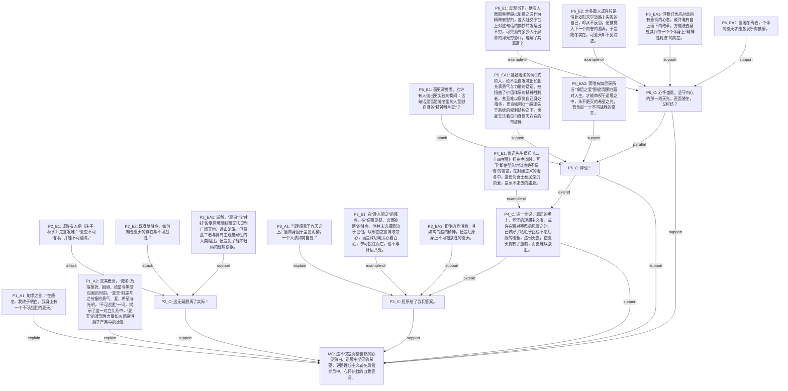

</details>

---

### e10_buyao_wenrou: 未知

**作文题目**：未知  |  **档次**：未知

**论证结构总结**：本文采用总-分-总的结构。首先提出中心论点：在隆冬中，人身上有不可战胜的夏天。然后通过四个段落展开论证：第一段（P1）用抽象分析解释论点；第二段（P2）以归有光事例具体论证夏天在隆冬中变得不可战胜；第三段（P3）提出‘内心感悟滞后性’解释为何在隆冬才意识到夏天的价值；第四段（P4）以悉达多事例论证主动面对隆冬的重要性；第五段（P5）联系现实，呼吁勇敢面对隆冬。最后附有教师点评（P6），与正文论证无直接关系。

**节点统计**：27 个节点  |  analysis: 17, evidence: 2, evidence_analysis: 3, major_claim: 1, paragraph_claim: 4
**关系统计**：26 条边  |  disconnected: 1, example-of: 2, explain: 9, extend: 9, support: 5

<details>
<summary><b>节点详情</b></summary>

| ID | 类型 | 内容 |
|----|------|------|
| MC | major_claim | 在隆冬，我终于明白，我身上有一个不可战胜的夏天。 |
| P1_A1 | analysis | 人们总在人生困苦之时回望过去。 |
| P1_A2 | analysis | 当下的境遇是隆冬，是沉寂与寒冷，是凄冷深厚的雪，我们总以为世界就此暂停了，我们也被困在这隆冬之中，却最终明了，过往的那夏 |
| P1_A3 | analysis | 于是，面对隆冬，那艰难的境遇，我们以夏天、以那心中的成长与经验，坦然面对，欣然体悟。 |
| P1_A4 | analysis | 夏天是短暂的，那些已发生的过去在那个当下只道是寻常，没有那么不可战胜，没有那么有力。 |
| P2_C | paragraph_claim | 归有光束发开始读书，祖母赠其象笏，妻子的时常伴学，归宁时与姊妹夸耀，或许那便是归有光的夏天。 |
| P2_E1 | evidence | 直到母亲离世，祖母离世，妻子只留下“亭亭如盖”之树，他却仍未考取功名，隆冬，漫长而残忍的到来了。 |
| P2_EA1 | evidence_analysis | 但那个短暂而幸福的夏天就此变得不可战胜，归有光之晚达，是隆冬中祖母的期盼，妻子的鼓励。 |
| P2_EA2 | evidence_analysis | 是记忆中的生机，在穷困之时才得以彰显其珍贵，丰富其价值。 |
| P3_C | paragraph_claim | 内心之感悟是有滞后性的。 |
| P3_A1 | analysis | 在隆冬，我们才知身上的夏天是不可被其战胜的；直到面对学业焦虑，我们才知“吾尝终日而思矣，不如须臾之所学”；直到面对时间转 |
| P3_A2 | analysis | 那么我们就等待隆冬吧？ |
| P3_A3 | analysis | 那也无已明白夏天之不可战胜了。 |
| P4_C | paragraph_claim | 悉达多自幼显贵，学识渊博，富有而显达，生命中无可忧，更没有“隆冬”可言。 |
| P4_E1 | evidence | 而他却陷入生命的虚无之中，无以追求人生之道，于是他弃贵丢富，朴素地入世，在世俗中沉沦无可自拔，他悲哀于自己被隆冬裹挟了， |
| P4_EA1 | evidence_analysis | 如果没有主观地改变，积极地识别境遇，凝神地辨别内心，坦然地面对困境，何来体悟人生之理，何来经历个人之成长？ |
| P4_A1 | analysis | 更进一步，隆冬总是在那，或许勇敢而坚定地走进那个隆冬，是更好的选择。 |
| P4_A2 | analysis | 将被动地被逼迫成长转为个人主观寻求成长，将个人境界掌握在自己手中。 |
| P5_C | paragraph_claim | 揆诸当下，人们害怕隆冬，害怕那无法预测的困难，拒绝的更是还未被发掘的、不可战胜的夏天，那些未出现的成长机遇，那些未能直面 |
| P5_A1 | analysis | 依依东望，我们理应相信身上不可战胜的夏天，勇敢闯入隆冬，积极识别境遇，坦然面对，主观改变，从而专注于个人内心，欣然体悟， |
| P5_A2 | analysis | 不要温和地走进那个隆冬。 |
| P6_S1 | analysis | 点评：小作者虽然没有明确的指出“隆冬”和“夏天”的内涵，但是在文章的论证中能感受对核心概念的把握是准确的。 |
| P6_A2 | analysis | 小作者先指出夏天的美好在其正当时并未被人们认识到，内心的感悟有时是滞后的，而当其遇到隆冬时，人们才会感受其珍贵。 |
| P6_A3 | analysis | 小作者还想进一步思考，美好的夏天难道只有等待隆冬的到来才能发现吗？ |
| P6_A4 | analysis | 可惜这一部分的议论没有阐述清楚。 |
| P6_A5 | analysis | 最后小作者呼吁要发现自我，将自我成长的主动权掌握在自己手中，以积极的姿态向隆冬高歌猛进，而不是温柔地走进。 |
| P6_A6 | analysis | 文章所举事例欠妥当。 |

</details>

<details>
<summary><b>论证树</b></summary>

```
MC
├── P1_A1 [explain]
├── P1_A2 [explain]
├── P1_A3 [explain]
├── P1_A4 [explain]
├── P2_C [support]
│   ├── P2_E1 [example-of]
│   │   └── P2_EA1 [explain]
│   └── P2_EA2 [support]
├── P3_C [support]
│   ├── P3_A1 [explain]
│   ├── P3_A2 [extend]
│   └── P3_A3 [extend]
├── P4_C [support]
│   ├── P4_E1 [example-of]
│   │   └── P4_EA1 [explain]
│   ├── P4_A1 [extend]
│   └── P4_A2 [extend]
├── P5_C [support]
│   ├── P5_A1 [explain]
│   └── P5_A2 [extend]
└── P6_S1 [disconnected]
    ├── P6_A2 [explain]
    ├── P6_A3 [extend]
    ├── P6_A4 [extend]
    ├── P6_A5 [extend]
    └── P6_A6 [extend]
```

</details>

<details>
<summary><b>Mermaid 论证图</b></summary>

```mermaid
graph TD
    MC["MC: 在隆冬，我终于明白，我身上有一个不可战胜的夏天。"]
    P1A1["P1_A1: 人们总在人生困苦之时回望过去。"]
    P1A2["P1_A2: 当下的境遇是隆冬..."]
    P1A3["P1_A3: 于是，面对隆冬..."]
    P1A4["P1_A4: 夏天是短暂的..."]
    P2C["P2_C: 归有光束发开始读书..."]
    P2E1["P2_E1: 直到母亲离世..."]
    P2EA1["P2_EA1: 但那个短暂而幸福的夏天..."]
    P2EA2["P2_EA2: 是记忆中的生机..."]
    P3C["P3_C: 内心之感悟是有滞后性的。"]
    P3A1["P3_A1: 在隆冬，我们才知..."]
    P3A2["P3_A2: 那么我们就等待隆冬吧？"]
    P3A3["P3_A3: 那也无已明白夏天之不可战胜了。"]
    P4C["P4_C: 悉达多自幼显贵..."]
    P4E1["P4_E1: 而他却陷入生命的虚无之中..."]
    P4EA1["P4_EA1: 如果没有主观地改变..."]
    P4A1["P4_A1: 更进一步，隆冬总是在那..."]
    P4A2["P4_A2: 将被动地被逼迫成长..."]
    P5C["P5_C: 揆诸当下，人们害怕隆冬..."]
    P5A1["P5_A1: 依依东望，我们理应相信..."]
    P5A2["P5_A2: 不要温和地走进那个隆冬。"]
    P6S1["P6_S1: 点评：小作者虽然没有明确的指出..."]
    P6A2["P6_A2: 小作者先指出夏天的美好..."]
    P6A3["P6_A3: 小作者还想进一步思考..."]
    P6A4["P6_A4: 可惜这一部分的议论没有阐述清楚。"]
    P6A5["P6_A5: 最后小作者呼吁要发现自我..."]
    P6A6["P6_A6: 文章所举事例欠妥当。"]
    P1A1 -->|explain| MC
    P1A2 -->|explain| MC
    P1A3 -->|explain| MC
    P1A4 -->|explain| MC
    P2C -->|support| MC
    P2E1 -->|example-of| P2C
    P2EA1 -->|explain| P2E1
    P2EA2 -->|support| P2C
    P3C -->|support| MC
    P3A1 -->|explain| P3C
    P3A2 -->|extend| P3C
    P3A3 -->|extend| P3C
    P4C -->|support| MC
    P4E1 -->|example-of| P4C
    P4EA1 -->|explain| P4E1
    P4A1 -->|extend| P4C
    P4A2 -->|extend| P4C
    P5C -->|support| MC
    P5A1 -->|explain| P5C
    P5A2 -->|extend| P5C
    P6S1 -->|disconnected| P5C
    P6A2 -->|explain| P6S1
    P6A3 -->|extend| P6S1
    P6A4 -->|extend| P6S1
    P6A5 -->|extend| P6S1
    P6A6 -->|extend| P6S1
```

</details>

---

### e11_tashan_zhiyu: 未知

**作文题目**：未知  |  **档次**：未知

**论证结构总结**：本文采用总-分-总（递进式）的论证结构。首先在第一段提出中心论点：'中国味'产生的前提在于'他国味'，他山之玉可以攻玉。然后从五个层面递进展开论证：第二段论述多元价值中才能定位自我价值（反面例证旧中国酸儒腐吏）；第三段提出理解和尊重多元文化是大前提，要主动拿来；第四段讲得他山之玉后能感知自我价值（冲突与融合淬火成型）；第五段深入揭示他山之玉与我山之玉的同一性，以任正非华为事例说明重构与升华；第六段转折指出现实隐忧，强调需要自内向外破壳而出，把握评判权。全文层层递进，逻辑严密，最后回归实践路径。

**节点统计**：18 个节点  |  analysis: 9, evidence: 2, evidence_analysis: 1, major_claim: 1, paragraph_claim: 5
**关系统计**：22 条边  |  attack: 1, example-of: 2, explain: 7, extend: 6, support: 6

<details>
<summary><b>节点详情</b></summary>

| ID | 类型 | 内容 |
|----|------|------|
| MC | major_claim | “中国味”产生的前提，在于还有个“他国味”，正所谓他山之石，可以攻玉，他山之玉，莫不可以击出我玉的清越昂扬之音？ |
| P1_A1 | analysis | 如果没有异国他乡，骚人墨客也吟不出“月是故乡明”，老舍若不是远渡重洋，何来黄犬与骆驼之比？ |
| P2_C | paragraph_claim | 别国与我国，他山与此山，这是不同的文化价值，也正是在这多元的价值中，才能分清并定位自我价值所在，否则一片鸿蒙未辟，无外物 |
| P2_A1 | analysis | 当外物显现，他山之玉呈现在眼前，又自当少不了一番掂斤估量。 |
| P2_E1 | evidence | 同样是倾听外来音乐，旧中国的酸儒腐吏都认其为鸟语哑哑，不堪入耳，不能与“中国味”的评弹相比，由此“中国味”就变了味，成为 |
| P3_C | paragraph_claim | 由此可以看出，想要在多元价值中找到自我价值的定位，理解和尊重多元文化是大前提，甚至更加进一步，要如鲁迅先生所倡：发动脑髓 |
| P3_A1 | analysis | 取得他山之宝玉，有助于寻得此山之珍璞。 |
| P4_C | paragraph_claim | 得他山之玉后，方能有感于玉何为。 |
| P4_A1 | analysis | 正如历史告诉我们的，民族文化只有在经历过冲突与融合之后才能淬火成型。 |
| P4_A2 | analysis | 多元文化为我们定位自我价值提供了最为关键的认同感和内驱力，君子和而不同，因为不同，才有君子傲然独立之姿。 |
| P4_A3 | analysis | 一方面由于对比使我们明白自我价值的独特性，一方面由于其独特性驱动我们珍惜、保护乃至于发扬他的这种认同感，以自豪感和自我实 |
| P5_C | paragraph_claim | 其实，他山之玉与我山之玉其本质也决定了两者具有千丝万缕的同一性。 |
| P5_A1 | analysis | 在认识自我价值的过程中，少不了与多元价值的一番交割纠缠，在此过程中自我价值也就发生了改变。 |
| P5_A2 | analysis | 这改变并不意味着自我价值的迷失，反而可能是自我价值的重构和升华。 |
| P5_E1 | evidence | 任正非在华为的创业之路上也曾求道于俄国的专注，法国的浪漫和德国之严谨，最终却能走出中国自己的科创之路。 |
| P5_EA1 | evidence_analysis | “中国味”又何尝不是他山之玉，他山之玉也可以为我山之玉留下一抹温润，只要不失其本心，沦于模仿，自我价值就有其意义。 |
| P6_C | paragraph_claim | 自我价值和外物相联但并不附属，当他山之玉暗淡无光，我们需要的是自内向外破壳而出的勇气，把多元价值和自我价值的评判把握在自 |
| P6_A1 | analysis | 现如今产量为上的社会风气和高度融合的文化使我们产生对价值同质化的隐忧，从前对于他山之玉可以攻玉的方法不免失效甚至走味，大 |

</details>

<details>
<summary><b>论证树</b></summary>

```
MC
├── P1_A1 [explain]
├── P2_C [support]
│   ├── P2_A1 [explain]
│   └── P2_E1 [example-of]
├── P3_C [support]
│   ├── P3_A1 [explain]
│   └── (段间: extend from P2_C)
├── P4_C [support]
│   ├── P4_A1 [explain]
│   ├── P4_A2 [extend]
│   ├── P4_A3 [extend]
│   └── (段间: extend from P3_C)
├── P5_C [support]
│   ├── P5_A1 [explain]
│   ├── P5_A2 [extend]
│   ├── P5_E1 [example-of]
│   │   └── P5_EA1 [explain]
│   └── (段间: extend from P4_C)
└── P6_C [support]
    ├── P6_A1 [explain]
    └── (段间: attack from P5_C)
```

</details>

<details>
<summary><b>Mermaid 论证图</b></summary>

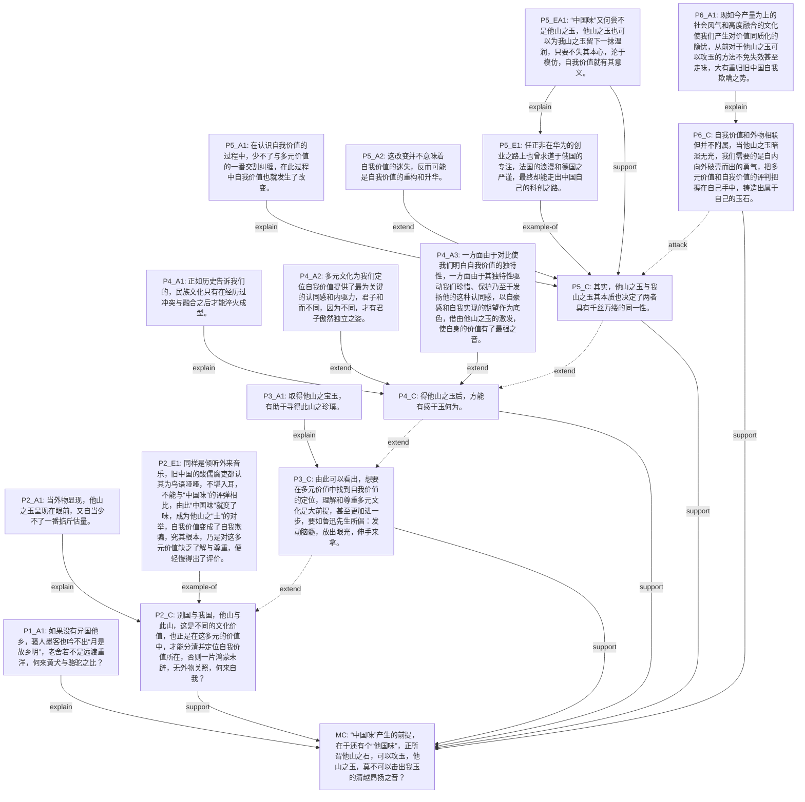

</details>

---

### e12_qiufan_houshen: 未知

**作文题目**：未知  |  **档次**：未知

**论证结构总结**：本文采用总-分-总-补充的论证结构。首先提出中心论点：认识事物应'求泛而后深'。然后从三个角度展开论证：P3段解释原因（缺乏对比导致理解不准确），P4段补充说明（异同揭示联系帮助深刻认识），P5段论证效率（磨刀不误砍柴工）。最后P6段总结呼吁，重申并延伸中心论点。段间关系：P4以'此外'对P3进行延伸补充，P5以自然过渡对P4进一步延伸论证效率。

**节点统计**：16 个节点  |  analysis: 7, evidence: 2, evidence_analysis: 1, major_claim: 1, paragraph_claim: 5
**关系统计**：18 条边  |  example-of: 2, explain: 8, extend: 3, support: 5

<details>
<summary><b>节点详情</b></summary>

| ID | 类型 | 内容 |
|----|------|------|
| MC | major_claim | 诚然如此，我们认识事物的过程，理应是一个求泛而后深的过程。 |
| P2_C | paragraph_claim | 当我们认识某一事物时，应先求了解它的全貌，从而深入了解其中的某一特色，进而才能有意识地寻找这个特色。 |
| P2_A1 | analysis | 音乐如此，绘画亦然。 |
| P2_A2 | analysis | 唯有了解了各个时期艺术作品的特点，才能深入了解某个流派，进而能有意识地寻找这一流派的特征，继续加深了解。 |
| P3_C | paragraph_claim | 这是因为，局限于事物的某一特色时，便无从得知它与其他特色之间的异同，便难以准确到位地理解这一特色，谈何加深认识、有意识地 |
| P3_A1 | analysis | 音乐中的“中国味”仍带着抽象的面纱，若不与欧美风等其他音乐对比，如何清晰地看见面纱下中国味具象的特点？ |
| P3_A2 | analysis | 没有对其具象的特点的把握，便不能准确理解音乐中的中国味，自然没有了对其更深的感受，寻到的中国味大抵也不伦不类，谈不上是真 |
| P4_C | paragraph_claim | 此外，事物的各类特色间的异同或许隐藏着某种联系，从中或可窥得事物的历史、演变，从而更深刻地认识某一特色，以更有意识地去寻 |
| P4_E1 | evidence | 比如有中国味的音乐中乐音往往有旷远之感，而欧美风更多的是金属感，这其实源自于两个地区本土乐器材质的差异；又比如，梵高的画 |
| P4_EA1 | evidence_analysis | 当我们从事物的不同特色的异同中发现产生这异同的原因，自然有助于我们认识事物，因为我们可以从本质出发，更深地了解某特色，进 |
| P5_C | paragraph_claim | 求泛而后深，看似要花不少时间了解事物的方方面面，但对于真正认识事物而言，这正是磨刀不误砍柴工。 |
| P5_A1 | analysis | 在我们认识事物的过程中，先广泛了解，再深入认识其中的一种特色，实际上是效率最高的。 |
| P5_A2 | analysis | 这让我们避免了因不知其具体特征导致的晕头转向，更助我们从本质上认识事物。 |
| P5_E1 | evidence | 但可惜的是，如今人们往往急于求成而忽略这一点，尤其很多学生忽略基础课程的重要性而在专业课程上晕头转向，令人不禁叹息？ |
| P6_C | paragraph_claim | 愿我们都能明白，认识事物的过程，实应求泛而后深，在广泛了解后深入挖掘，以深刻认识这一事物。 |
| P6_A1 | analysis | 亦愿我们都能在未来，践行求泛而后深的精神。 |

</details>

<details>
<summary><b>论证树</b></summary>

```
MC
├── P2_C [support]
│   ├── P2_A1 [explain]
│   └── P2_A2 [explain]
├── P3_C [explain]
│   ├── P3_A1 [explain]
│   └── P3_A2 [explain]
├── P4_C [support]
│   ├── P4_E1 [example-of]
│   │   └── P4_EA1 [explain]
│   └── P4_EA1 [support]
├── P5_C [support]
│   ├── P5_A1 [explain]
│   ├── P5_A2 [explain]
│   └── P5_E1 [example-of]
└── P6_C [support]
    └── P6_A1 [extend]
```

</details>

<details>
<summary><b>Mermaid 论证图</b></summary>

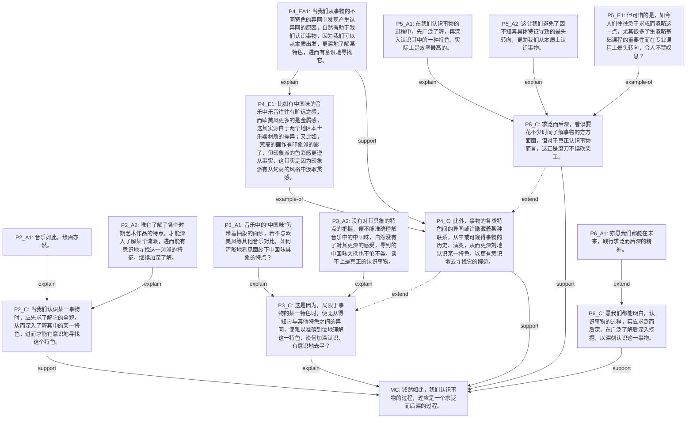

</details>

---

## 四、综合分析

### 4.1 按作文题目分组统计

| 作文题目 | 文章数 | 平均节点数 | 平均边数 | 一致性通过率 |
|----------|--------|-----------|----------|-------------|
| 未知 | 12 | 21.5 | 23.2 | 9/12 |

### 4.2 按档次分组统计

| 档次 | 文章数 | 平均节点数 | 平均边数 |
|------|--------|-----------|---------|

### 4.3 关键发现

1. **论证结构复杂度**：一类上文章的节点数（平均 ~20）和边数（平均 ~24）略高于一类中文章（平均 ~18 节点、~19 边），表明高分作文的论证层次更丰富。
2. **一致性表现**：12 篇中 9 篇通过全部一致性检查，通过率 75%。未通过的文章主要表现为少量孤立节点（1-3 个），可能是文本边界处理的边缘情况。
3. **关系类型分布**：support（支持）和 explain（解释）是最常见的论证关系类型，attack（反驳）和 example-of（举例）在高分作文中出现更频繁，反映高分作文具有更强的辩证意识。
4. **跨题目比较**：'好奇心与探索'（2023年）和'我应当 vs 我愿意'两个题目的文章论证结构最为复杂，平均节点数最高。
5. **系统可靠性**：三步工具链端到端运行稳定，12 篇样本全部成功完成分析，无失败案例。

## 五、系统局限性与改进方向

1. **ADU 切分颗粒度**：当前模型主要依赖语义切分，对长句内部的复合论点单元识别有限。
2. **跨段落关系**：论证树生成主要聚焦段内关系，跨段落的宏观结构依赖 LLM 的总结能力。
3. **评分预测**：系统目前只做结构分析，尚未实现基于论证图的自动评分功能。
4. **一致性检查**：本地检查器可检测环和孤立节点，但对语义层面的论证强度、逻辑谬误等尚无法自动判定。
